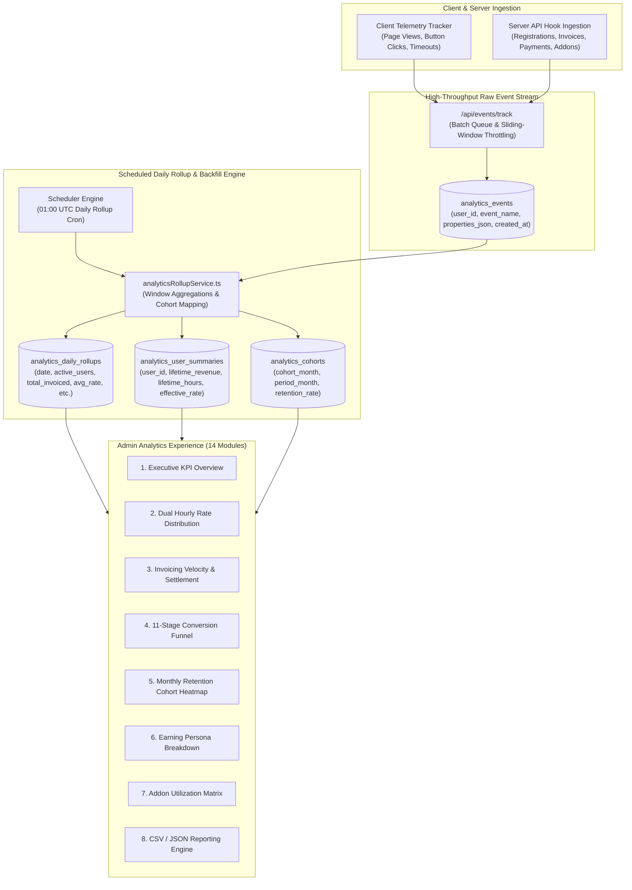

# Wello — Analytics Data Layer & Intelligence Engine Specification

This document details the telemetry ingestion pipeline, aggregation rollups, 14-dimension administrative analytics modules, 11-stage conversion funnels, and reporting exports across the Wello analytics infrastructure ([`backend/utils/analyticsAdminService.ts`](backend/utils/analyticsAdminService.ts), [`backend/utils/analyticsRollupService.ts`](backend/utils/analyticsRollupService.ts), and [`backend/utils/analyticsIngestService.ts`](backend/utils/analyticsIngestService.ts)).

---

## 1. Analytics Data Layer Architecture



---

## 2. Event Catalogue

| Event Name | Trigger Source | Payload Properties | Business Purpose |
| :--- | :--- | :--- | :--- |
| `user_registered` | Server (`/api/auth/verify-otp`) | `{ email, referral_source }` | Funnel Step 1: User Onboarding |
| `profile_completed`| Client / Server (`/api/me`) | `{ target_hourly, base_currency, persona }` | Funnel Step 2: Rate Setup |
| `timer_started` | Client / Server (`/api/timer/start`)| `{ project_id, is_billable }` | Work session engagement |
| `timer_stopped` | Client / Server (`/api/timer/stop`) | `{ session_id, duration_sec, earned_value }` | Funnel Step 3: Work Logged |
| `project_created` | Client / Server (`/api/projects`) | `{ client_id, currency, billing_type }` | Client pipeline growth |
| `quote_created` | Client / Server (`/api/quotes`) | `{ project_id, total_amount }` | Proposal pipeline |
| `quote_accepted` | Client / Server (`/public/quote`) | `{ quote_id, client_email }` | Project conversion |
| `invoice_issued` | Server (`/api/invoices`) | `{ invoice_id, total_amount, currency }` | Funnel Step 4: Billing Issued |
| `payment_received`| Server (`/api/payments`) | `{ invoice_id, amount_paid, method }` | Funnel Step 5: Cash Settled |
| `addon_activated` | Server (`/api/store/addons/act`)| `{ addon_key, persona }` | Feature adoption |
| `export_generated`| Server (`/api/export`) | `{ format, export_type }` | Data portability usage |

---

## 3. The 11-Stage Conversion Funnel

Configured in `analytics_funnel_definitions` and `analytics_funnel_steps`:

```
Stage 1:  Visitor Landing (`page_view_home`)
  └── Stage 2:  OTP Requested (`otp_requested`)
        └── Stage 3:  Account Verified (`user_registered`)
              └── Stage 4:  Profile & Rate Configured (`profile_completed`)
                    └── Stage 5:  First Client Created (`client_created`)
                          └── Stage 6:  First Project Created (`project_created`)
                                └── Stage 7:  First Timer Session Logged (`work_session_completed`)
                                      └── Stage 8:  First Quote Dispatched (`quote_created`)
                                            └── Stage 9:  First Invoice Issued (`invoice_issued`)
                                                  └── Stage 10: First Payment Received (`payment_received`)
                                                        └── Stage 11: Free Addon Activated (`addon_activated`)
```

---

## 4. The 14 Administrative Analytics Modules

The Admin Analytics Console ([`frontend/pages/admin/analytics.vue`](frontend/pages/admin/analytics.vue)) provides 14 distinct analytical modules:

1. **Executive KPI Header**: Active users, Gross Platform Revenue, Median Realized Hourly Rate, 30d Invoicing Volume.
2. **Dual Hourly Rate Distribution**: Histogram comparing planned Target Rates vs actual Realized Effective Rates across all user personas.
3. **Revenue Velocity & Settlement Time**: Average days from invoice creation to cash collection (DSO - Days Sales Outstanding).
4. **Retention Cohort Heatmap**: 12-month trailing cohort retention matrix (% of users active in months $M+1, M+2, \dots, M+12$).
5. **11-Stage Conversion Funnel**: Drop-off rates between initial registration and first client payment settlement.
6. **Earning Persona Breakdown**: Distribution across `freelancer_projects`, `salaried`, `daily_hourly_wage`, `gig_retainer`, and `mixed_hybrid`.
7. **Free Addon Entitlement Adoption**: Heatmap of active installations per free addon (`invoicing_pro`, `tax_calculator`, `currency_converter`, `reports_advanced`).
8. **Currency & Geographic Exposure**: Volume distribution across USD, EUR, GBP, CAD, AUD, INR, and other currencies.
9. **Non-Project Income vs Project Yield**: Share of total freelancer earnings derived from client milestones vs retainers/royalties.
10. **Overhead Expense Burden**: Average percentage of gross revenue consumed by operational subscriptions and expenses.
11. **Tax Schema Distribution**: Usage share of Exclusive VAT, Inclusive GST, and Cross-Border Reverse Charge invoicing.
12. **Client Concentration Risk Index**: Percentage of users relying on a single client for $>60\%$ of total income.
13. **Data Export & Portability Usage**: Frequency of JSON / CSV account exports and data retention operations.
14. **Custom Filter Bar & Data Table**: Granular multi-dimensional filtering by country, persona, currency, date range, with one-click CSV and JSON exports.

---

## 5. Daily Rollup Aggregation Pipeline

Executed nightly by [`backend/utils/analyticsRollupService.ts`](backend/utils/analyticsRollupService.ts):

$$\text{Daily Active Users (DAU)} = \text{Count Distinct } (\text{user\_id}) \text{ in } \text{analytics\_events for date } D$$
$$\text{Average Effective Rate} = \frac{\sum_{\text{active}} R_{\text{effective}}}{\text{Active Users Count}}$$
$$\text{Total Platform Invoiced} = \sum_{D} \text{Invoice Totals (Normalized to Base Currency)}$$

Results are indexed in `analytics_daily_rollups` with composite index `(rollup_date, metric_name)` for millisecond query performance.
