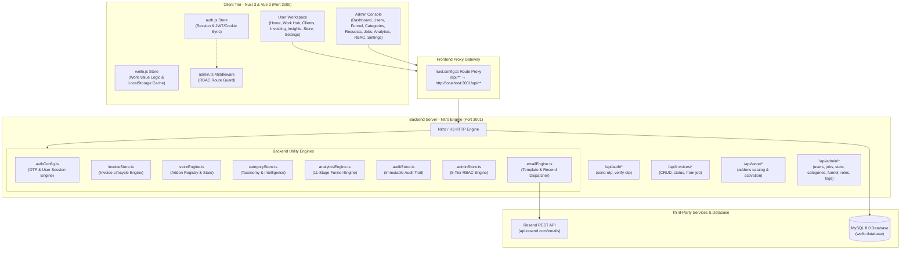
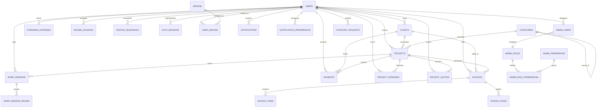
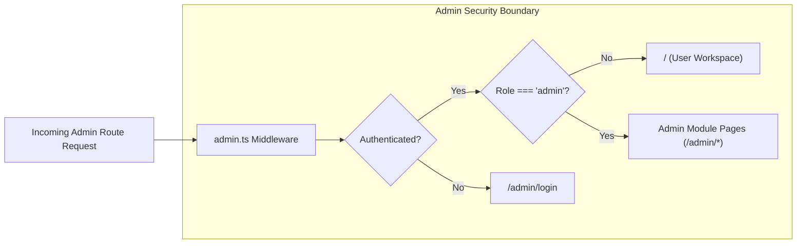

# Wello – System Architecture & Module Specification

## 1. Executive Summary & Core Philosophy

**Wello** is a work-value intelligence, client management, and revenue optimization platform engineered for independent professionals, freelancers, and agencies. 

Unlike traditional project management or basic time-tracking software, Wello is designed around the concept of **"Real Effective Hourly Value"**. It reveals the true economic yield of a professional's time across projects, quotes, unbilled hours, non-billable overhead (proposals, revisions, client calls), and client relationships.

```
Real Effective Hourly Value = (Total Collected Revenue - Direct Project Expenses) / Total Hours Worked (Paid + Unpaid)
```

---

## 2. High-Level System Architecture

Wello uses a **decoupled full-stack TypeScript architecture** with a reactive client-side frontend, an asynchronous API backend, and a dual-layer persistence model (relational MySQL 8 + browser local cache with in-memory server stores).



### Technology Stack

| Layer | Technology | Version | Key Responsibilities |
| :--- | :--- | :--- | :--- |
| **Frontend Framework** | [Nuxt 3](file:///d:/Apps/Hexpines/Wello/frontend/package.json) | `^3.13.0` | SSR, File-based routing, Layout transitions, Teleports |
| **UI Engine** | [Vue 3](file:///d:/Apps/Hexpines/Wello/frontend/package.json) | `^3.4.0` | Composition API (`<script setup>`), Reactive references |
| **State Management** | [Pinia](file:///d:/Apps/Hexpines/Wello/frontend/stores/wello.js) | `^2.2.0` | In-memory reactive state, browser storage persistence |
| **Utilities** | [VueUse](file:///d:/Apps/Hexpines/Wello/frontend/package.json) | `^11.0.0` | Browser APIs, cookies, click-outside handlers |
| **Styling & CSS** | [main.css](file:///d:/Apps/Hexpines/Wello/frontend/assets/css/main.css) | Custom | Modern CSS variables, typography, micro-animations |
| **Backend Runtime** | [NitroPack](file:///d:/Apps/Hexpines/Wello/backend/package.json) | `^2.9.7` | High-throughput server running on port `3001` |
| **HTTP Routing** | [H3](file:///d:/Apps/Hexpines/Wello/backend/package.json) | `^1.12.0` | Composables, event handlers, body parsers |
| **Database** | [MySQL 8.0](file:///d:/Apps/Hexpines/Wello/backend/database/schema.sql) | `mysql2 ^3.11.0` | Relational tables, foreign keys, constraints, JSON storage |
| **Email Service** | [Resend REST API](file:///d:/Apps/Hexpines/Wello/backend/utils/authConfig.ts#L281-L329) | HTTP | Passwordless OTP dispatch and notifications |

---

## 3. Database Schema & Data Models (Single Source of Truth)

Defined in [schema.sql](file:///d:/Apps/Hexpines/Wello/backend/database/schema.sql) and managed via **Knex.js** migrations ([database/migrations](file:///d:/Apps/Hexpines/Wello/backend/database/migrations)), the relational architecture enforces referential integrity, decimal precision (`DECIMAL(19,4)`), ISO 4217 currencies, IANA timezones, and soft delete (`deleted_at`) protections on all financial entities (preventing cascading data loss):



### Table Dictionary (25 Core & Operational Tables)

| Domain | Table | Purpose | Primary Key | Soft Delete | Key Indexes & Constraints |
|---|---|---|---|---|---|
| **Core** | `users` | User profiles, target hourly rate, base currency, IANA timezone, E.164 phone | `id` (INT) | `deleted_at` | `email` (UQ), `phone_e164` (UQ), `status`, `created_at` |
| **Core** | `categories` | Service & trade taxonomy with parent/child hierarchy | `id` (INT) | No | `slug` (UQ), `parent_id` (FK), `is_active` |
| **Core** | `clients` | Client directory & CRM contact records | `id` (INT) | `deleted_at` | `user_id` (FK), `(user_id, deleted_at)` |
| **Core** | `projects` | Project & job lifecycle tracker (derived revenue/expenses) | `id` (INT) | `deleted_at` | `user_id` (FK), `client_id` (FK), `category_id` (FK), `status` |
| **Work** | `work_sessions` | Granular work time tracking in seconds with payment types | `id` (INT) | `deleted_at` | `user_id` (FK), `project_id` (FK), `started_at`, `payment_type` |
| **Work** | `work_session_pauses` | Pause & resume duration intervals per session | `id` (INT) | No | `work_session_id` (FK) |
| **Money** | `payments` | Direct project collected revenue payments | `id` (INT) | `deleted_at` | `user_id` (FK), `project_id` (FK), `client_id` (FK), `paid_date` |
| **Money** | `project_expenses` | Direct project cost allocations | `id` (INT) | `deleted_at` | `user_id` (FK), `project_id` (FK), `expense_date` |
| **Money** | `overhead_expenses` | Non-project recurring & operational business overheads | `id` (INT) | `deleted_at` | `user_id` (FK), `expense_date`, `is_recurring` |
| **Money** | `income_sources` | Retainers, advisory, and alternative revenue streams | `id` (INT) | `deleted_at` | `user_id` (FK), `is_active` |
| **Money** | `fx_rates` | Daily foreign exchange conversion matrix | `id` (INT) | No | `(rate_date, base_currency, quote_currency)` (UQ) |
| **Money** | `project_quotes` | Versioned customer quotations and estimates | `id` (INT) | `deleted_at` | `user_id` (FK), `(project_id, version)` |
| **Billing** | `invoices` | Professional snapshot invoices with tax & discounts | `id` (INT) | `deleted_at` | `(user_id, invoice_number)` (UQ), `project_id` (FK), `status` |
| **Billing** | `invoice_items` | Itemized line items per invoice | `id` (INT) | No | `invoice_id` (FK) |
| **Billing** | `invoice_taxes` | Itemized tax breakdowns (VAT, GST, Sales Tax) | `id` (INT) | No | `invoice_id` (FK) |
| **Billing** | `invoice_sequences` | Consecutive auto-increment numbering sequence per user | `id` (INT) | No | `(user_id, prefix, year)` (UQ) |
| **Auth** | `otp_codes` | Cryptographic hashed OTP verification records | `id` (INT) | No | `(email, purpose)`, `expires_at` |
| **Auth** | `auth_sessions` | Token-hashed authenticated sessions with device & IP info | `id` (INT) | No | `token_hash` (UQ), `user_id` (FK), `expires_at` |
| **Platform** | `addons` | Modular platform feature extensions (Basic Invoicing, etc.) | `id` (INT) | No | `slug` (UQ), `status` |
| **Platform** | `user_addons` | User addon entitlements & activation state | `id` (INT) | No | `(user_id, addon_id)` (UQ) |
| **Platform** | `notifications` | In-app user notifications | `id` (INT) | No | `user_id` (FK), `(user_id, is_read)` |
| **Platform** | `notification_preferences` | User notification channel & topic preferences | `id` (INT) | No | `(user_id, channel, topic)` (UQ) |
| **Admin** | `category_requests` | Community-requested service categories with workflow | `id` (INT) | No | `user_id` (FK), `status`, `user_email` |
| **Admin** | `admin_roles` | Role-based access control (RBAC) role definitions | `id` (INT) | No | `role_key` (UQ) |
| **Admin** | `admin_permissions` | Granular capability permissions per module | `id` (INT) | No | `permission_key` (UQ) |
| **Admin** | `admin_role_permissions` | Role-to-permission associative mapping | `(role, perm)` | No | Compound Primary Key |
| **Admin** | `admin_users` | Administrative user accounts with role assignment | `id` (INT) | No | `email` (UQ), `user_id` (FK), `role_key` |
| **Ops** | `email_templates` | Dynamic transactional email templates with variables | `id` (INT) | No | `template_key` (UQ) |
| **Ops** | `email_logs` | Outbound email delivery audit records with provider IDs | `id` (BIGINT) | No | `recipient`, `status`, `created_at` |
| **Ops** | `audit_logs` | Append-only administrative and security audit trail | `id` (BIGINT) | No | `admin_email`, `action`, `created_at` |
| **Ops** | `admin_notifications` | Dedicated alerts and notifications for system administrators | `id` (INT) | No | `is_read`, `created_at` |
| **Ops** | `analytics_events` | High-volume registration funnel and telemetry events stream | `id` (BIGINT) | No | `event_name`, `stage`, `user_id`, `created_at` |
| **Ops** | `analytics_daily_rollups` | Pre-computed daily dimensional rollups for fast analytics | `id` (BIGINT) | No | `(rollup_date, metric_key, dim_key, dim_val)` (UQ) |


---

## 4. User Workspace Modules

### 4.1 Authentication & Onboarding
* **Pages:** [login.vue](file:///d:/Apps/Hexpines/Wello/frontend/pages/login.vue), [register.vue](file:///d:/Apps/Hexpines/Wello/frontend/pages/register.vue)
* **Backend API:** [send-otp.post.ts](file:///d:/Apps/Hexpines/Wello/backend/api/auth/send-otp.post.ts), [verify-otp.post.ts](file:///d:/Apps/Hexpines/Wello/backend/api/auth/verify-otp.post.ts)
* **Store & Utils:** [auth.js](file:///d:/Apps/Hexpines/Wello/frontend/stores/auth.js), [authConfig.ts](file:///d:/Apps/Hexpines/Wello/backend/utils/authConfig.ts)
* **Features:**
  - Passwordless 6-digit cryptographic OTP generation.
  - Automatic email dispatch using the Resend REST API.
  - Fallback local development sandbox mode with direct onscreen code preview if no API key is provided.
  - Dual session management: Nuxt cookies (`wello_auth_token_v1`, `wello_auth_user_v1`) + browser `localStorage`.
  - Demo user shortcuts for testing (`rahul@mehtatech.in` and `admin@wello.com`).

---

### 4.2 Home Command Center (Value Dashboard)
* **Page:** [index.vue](file:///d:/Apps/Hexpines/Wello/frontend/pages/index.vue)
* **Store:** [useWelloStore](file:///d:/Apps/Hexpines/Wello/frontend/stores/wello.js#L269)
* **Features:**
  - **Today's Real Value:** Main hero metric calculating actual hourly yield for today:
    $$\text{Today's Rate} = \frac{\text{Net Income Today}}{\text{Hours Worked Today}}$$
  - **Target Hourly Delta:** Visual indicator and progress bar displaying comparison to target rate:
    $$\Delta\% = \frac{\text{Actual Rate} - \text{Target Rate}}{\text{Target Rate}} \times 100$$
  - **Quick Actions Toolbar:** One-tap triggers for starting work sessions, creating projects, logging income, and recording expenses.
  - **Active Work Banner:** Real-time indicator displaying the currently active timer with pause/resume controls.

---

### 4.3 Work Hub & Project Lifecycle Management
* **Pages:** [work/index.vue](file:///d:/Apps/Hexpines/Wello/frontend/pages/work/index.vue), [projects/[id].vue](file:///d:/Apps/Hexpines/Wello/frontend/pages/projects/[id].vue), [jobs/index.vue](file:///d:/Apps/Hexpines/Wello/frontend/pages/jobs/index.vue)
* **Components:** [ProjectFormModal.vue](file:///d:/Apps/Hexpines/Wello/frontend/components/ProjectFormModal.vue), [QuoteModal.vue](file:///d:/Apps/Hexpines/Wello/frontend/components/QuoteModal.vue), [StatusBadge.vue](file:///d:/Apps/Hexpines/Wello/frontend/components/StatusBadge.vue)
* **Project Status Flow:**
  $$\text{Potential} \longrightarrow \text{Quoted} \longrightarrow \text{Approved / In Progress} \longrightarrow \text{Completed} \lor \text{Lost}$$
* **Features:**
  - Filter tabs: *All Projects*, *Active Jobs*, *Quotes/Proposals*, *Potential*, *Completed*, and *Lost*.
  - Financial summary per project: Quote Amount, Revenue Received, Direct Expenses, Net Profit, and Net Hourly Value.
  - Quotation engine logging scope notes, delivery hours estimate, submission date, and quote acceptance status.
  - One-click quote-to-invoice creation.

---

### 4.4 Time Tracking & Work Sessions
* **Components:** [TimerModal.vue](file:///d:/Apps/Hexpines/Wello/frontend/components/TimerModal.vue), [SessionModal.vue](file:///d:/Apps/Hexpines/Wello/frontend/components/SessionModal.vue)
* **Store Actions:** `startTimer`, `stopTimer`, `pauseTimer`, `resumeTimer`, `logSession` in [wello.js](file:///d:/Apps/Hexpines/Wello/frontend/stores/wello.js)
* **Features:**
  - Live stopwatch timer with browser-persisted state.
  - Manual session logging with custom date/time pickers.
  - **10 Work Session Types:** `meeting`, `call`, `discussion`, `planning`, `proposal`, `travel`, `production`, `revision`, `delivery`, `other`.
  - **3 Payment Classifications:**
    1. `paid`: Billable project execution.
    2. `unpaid`: Unbilled scope creep and overhead.
    3. `intentional_unpaid`: Conscious non-billable investments categorized by reason (`learning`, `portfolio`, `charity`, `strategic`, `personal`, `client_work`).

---

### 4.5 Clients Directory & CRM
* **Pages:** [clients/index.vue](file:///d:/Apps/Hexpines/Wello/frontend/pages/clients/index.vue), [clients/[id].vue](file:///d:/Apps/Hexpines/Wello/frontend/pages/clients/[id].vue)
* **Features:**
  - Client directory with contact info, company name, and location.
  - Aggregate client metrics: Total revenue collected, total hours logged, active jobs, and effective client hourly rate.
  - Relationship history showing all linked projects, payments, and unpaid time leakage per client.

---

### 4.6 Payments & Expenses Ledger
* **Components:** [PaymentModal.vue](file:///d:/Apps/Hexpines/Wello/frontend/components/PaymentModal.vue), [ExpenseModal.vue](file:///d:/Apps/Hexpines/Wello/frontend/components/ExpenseModal.vue)
* **Database Tables:** `payments`, `project_expenses` in [schema.sql](file:///d:/Apps/Hexpines/Wello/backend/database/schema.sql#L93-L111)
* **Features:**
  - Milestone and installment payment tracking linked to projects.
  - Direct expense tracking for project-specific costs (software licenses, contractors, travel, assets).
  - Real-time deduction of expenses from revenue to calculate net project margin.

---

### 4.7 Basic Invoicing Addon
* **Pages:** [invoicing/index.vue](file:///d:/Apps/Hexpines/Wello/frontend/pages/invoicing/index.vue), [invoicing/[id].vue](file:///d:/Apps/Hexpines/Wello/frontend/pages/invoicing/[id].vue)
* **Backend API:** [index.get.ts](file:///d:/Apps/Hexpines/Wello/backend/api/invoices/index.get.ts), [index.post.ts](file:///d:/Apps/Hexpines/Wello/backend/api/invoices/index.post.ts), [from-job.post.ts](file:///d:/Apps/Hexpines/Wello/backend/api/invoices/from-job.post.ts), [status.post.ts](file:///d:/Apps/Hexpines/Wello/backend/api/invoices/status.post.ts), [[id].get.ts](file:///d:/Apps/Hexpines/Wello/backend/api/invoices/[id].get.ts), [[id].delete.ts](file:///d:/Apps/Hexpines/Wello/backend/api/invoices/[id].delete.ts)
* **Store:** [invoiceStore.ts](file:///d:/Apps/Hexpines/Wello/backend/utils/invoiceStore.ts)
* **Features:**
  - **Status Lifecycle:** `DRAFT` $\rightarrow$ `SENT` $\rightarrow$ `PAID` $\rightarrow$ `OVERDUE` $\rightarrow$ `CANCELLED`.
  - Itemized lines with automatic quantity, rate, discount, and tax (GST/VAT) calculation.
  - One-click invoice generation from completed jobs.
  - Print-optimized CSS (`@media print`) rendering professional PDF/paper invoices with business branding and tax details.

---

### 4.8 Insights & Business Intelligence
* **Page:** [insights/index.vue](file:///d:/Apps/Hexpines/Wello/frontend/pages/insights/index.vue)
* **Time Windows:** `Today`, `This Week`, `This Month`, `All Time`, `Custom Date Range`.
* **Analytics Metrics:**
  - **Time-to-Money Velocity:** Average duration between starting a project and receiving initial payment.
  - **Unpaid Time Leakage:** Quantifies unbilled time grouped by reason.
  - **Client Profitability Rankings:** Ranks clients by net income produced per hour worked.
  - **Category Yield:** Compares hourly return across different service lines.

---

### 4.9 Wello Store (Modular Addon Platform)
* **Page:** [store/index.vue](file:///d:/Apps/Hexpines/Wello/frontend/pages/store/index.vue)
* **Backend API:** [index.get.ts](file:///d:/Apps/Hexpines/Wello/backend/api/store/addons/index.get.ts), [activate.post.ts](file:///d:/Apps/Hexpines/Wello/backend/api/store/addons/activate.post.ts)
* **Store:** [storeEngine.ts](file:///d:/Apps/Hexpines/Wello/backend/utils/storeEngine.ts)
* **Features:**
  - In-app store for activating modular platform extensions (e.g. Basic Invoicing, Recurring Retainers).
  - One-click enable/disable for addons with immediate workspace integration.
  - 100% free addon model: all addons are free to activate with no paid plans, subscriptions, or platform checkout fees.

---

### 4.10 Settings & Business Profile
* **Page:** [settings/index.vue](file:///d:/Apps/Hexpines/Wello/frontend/pages/settings/index.vue)
* **Features:**
  - Target Hourly Rate setting and currency selector (`₹`, `$`, `€`, `£`).
  - Invoicing identity profile: Legal Business Name, Address, Tax ID / GSTIN, Logo, and Default Terms.
  - Data reset and session diagnostic controls.

---

## 5. Administrative Account & Admin Console

Administrative routes are protected by the [admin.ts](file:///d:/Apps/Hexpines/Wello/frontend/middleware/admin.ts) middleware and rendered via the dedicated [admin.vue](file:///d:/Apps/Hexpines/Wello/frontend/layouts/admin.vue) layout.



---

### 5.1 Admin Gatekeeper & Login Portal
* **Files:** [admin/login.vue](file:///d:/Apps/Hexpines/Wello/frontend/pages/admin/login.vue), [admin.ts](file:///d:/Apps/Hexpines/Wello/frontend/middleware/admin.ts)
* **Features:**
  - Isolated login portal for platform administrators.
  - Role validation: Non-admin users are automatically redirected to the user workspace.
  - One-click demo credentials for system administrators (`admin@wello.com`).

---

### 5.2 Admin Executive Dashboard
* **Page:** [admin/index.vue](file:///d:/Apps/Hexpines/Wello/frontend/pages/admin/index.vue)
* **Backend API:** [stats.get.ts](file:///d:/Apps/Hexpines/Wello/backend/api/admin/stats.get.ts)
* **Features:**
  - **5 Primary KPI Cards:** *Total Users*, *Pending Category Queue*, *Jobs & Services Count*, *Overall Funnel Conversion Rate*, and *Audit Logs Count*.
  - Quick action queue for reviewing pending category requests.
  - Mini-funnel progress visualization.

---

### 5.3 User Directory & Role Assignment
* **Page:** [admin/users.vue](file:///d:/Apps/Hexpines/Wello/frontend/pages/admin/users.vue)
* **Backend API:** [users.get.ts](file:///d:/Apps/Hexpines/Wello/backend/api/admin/users.get.ts), [status.post.ts](file:///d:/Apps/Hexpines/Wello/backend/api/admin/users/status.post.ts)
* **Features:**
  - Searchable user table showing Avatar, Name, Email, Service Category, Target Hourly Rate, and Activity.
  - Role management: Toggle accounts between Standard `user` and `admin`.
  - Self-demotion safeguards preventing active admins from locking themselves out.

---

### 5.4 11-Stage Registration Pipeline & Funnel
* **Page:** [admin/registration-pipeline.vue](file:///d:/Apps/Hexpines/Wello/frontend/pages/admin/registration-pipeline.vue)
* **Backend API:** [funnel.get.ts](file:///d:/Apps/Hexpines/Wello/backend/api/admin/funnel.get.ts)
* **Engine:** [analyticsEngine.ts](file:///d:/Apps/Hexpines/Wello/backend/utils/analyticsEngine.ts)
* **11 Monitored Funnel Milestones:**
  1. `registration_started`
  2. `basic_details_submitted`
  3. `email_verification_sent`
  4. `email_verified`
  5. `profile_started`
  6. `profile_completed`
  7. `category_selected`
  8. `location_added`
  9. `registration_completed`
  10. `first_job_activity`
  11. `first_connection`
* **Metrics:** Computes stage volume, cumulative conversion rate relative to Stage 1, and drop-off rate from the preceding stage. Includes date range filtering.

---

### 5.5 Service Categories Taxonomy
* **Page:** [admin/categories.vue](file:///d:/Apps/Hexpines/Wello/frontend/pages/admin/categories.vue)
* **Backend API:** [categories.post.ts](file:///d:/Apps/Hexpines/Wello/backend/api/admin/categories.post.ts), [index.get.ts](file:///d:/Apps/Hexpines/Wello/backend/api/categories/index.get.ts)
* **Store:** [categoryStore.ts](file:///d:/Apps/Hexpines/Wello/backend/utils/categoryStore.ts)
* **Features:**
  - Service taxonomy management: Name, Slug, Icon, and Description.
  - Hierarchical nesting supporting Main Categories and Subcategories (`parentId`).
  - Active/Disabled toggling.
  - **Category Intelligence:** Aggregates provider count, active jobs, completed jobs, connection rate, and market growth rate per category.

---

### 5.6 User Category Requests Queue
* **Page:** [admin/category-requests.vue](file:///d:/Apps/Hexpines/Wello/frontend/pages/admin/category-requests.vue)
* **Backend API:** [category-requests.get.ts](file:///d:/Apps/Hexpines/Wello/backend/api/admin/category-requests.get.ts), [category-requests.post.ts](file:///d:/Apps/Hexpines/Wello/backend/api/admin/category-requests.post.ts)
* **Features:**
  - Moderation queue for custom categories requested by users during registration.
  - Demand aggregation grouping identical requests and tracking frequency (`requestCount`).
  - Moderation states: `PENDING`, `UNDER_REVIEW`, `APPROVED`, `REJECTED`, `MERGED`.
  - Direct promotion: Approving a request can automatically convert it into an active platform category.

---

### 5.7 Jobs & Services Moderation
* **Page:** [admin/jobs.vue](file:///d:/Apps/Hexpines/Wello/frontend/pages/admin/jobs.vue)
* **Backend API:** [jobs.get.ts](file:///d:/Apps/Hexpines/Wello/backend/api/admin/jobs.get.ts)
* **Features:**
  - Platform-wide moderation table for all projects and jobs.
  - Displays Job Title, Provider Name/Email, Category, Quote Value, Estimated Hours, and Creation Date.
  - Real-time search filtering across titles, provider names, and emails.

---

### 5.8 Wello Store Addons Administration
* **Page:** [admin/store.vue](file:///d:/Apps/Hexpines/Wello/frontend/pages/admin/store.vue)
* **Backend API:** [addons.get.ts](file:///d:/Apps/Hexpines/Wello/backend/api/admin/store/addons.get.ts), [addons.post.ts](file:///d:/Apps/Hexpines/Wello/backend/api/admin/store/addons.post.ts), [analytics.get.ts](file:///d:/Apps/Hexpines/Wello/backend/api/admin/store/analytics.get.ts)
* **Engine:** [storeEngine.ts](file:///d:/Apps/Hexpines/Wello/backend/utils/storeEngine.ts)
* **Features:**
  - Manage store catalog products: create, edit, and archive addons.
  - Lifecycle statuses: `PUBLISHED`, `DRAFT`, and `ARCHIVED`.
  - Feature bullet-point editor and icon assignment.
  - Addon adoption telemetry: Total catalog addons, published items, user activations, and store visit counts.

---

### 5.9 Platform Analytics Center
* **Page:** [admin/analytics.vue](file:///d:/Apps/Hexpines/Wello/frontend/pages/admin/analytics.vue)
* **Backend API:** [analytics.get.ts](file:///d:/Apps/Hexpines/Wello/backend/api/admin/analytics.get.ts)
* **Features:**
  - Core platform ratios: Verification Rate, Job Completion Rate, and Connection Conversion Rate.
  - **Geographic User Density Table:** Summarizes users and active jobs grouped by Country, State, and City.
  - Filter by *Today*, *Last 7 Days*, *Last 30 Days*, *This Quarter*, or custom dates.

---

### 5.10 Role-Based Access Control (RBAC)
* **Views:** [admin/roles.vue](file:///d:/Apps/Hexpines/Wello/frontend/pages/admin/roles.vue), [admin/settings.vue?tab=roles](file:///d:/Apps/Hexpines/Wello/frontend/pages/admin/settings.vue#L224-L250)
* **Backend API:** [roles.get.ts](file:///d:/Apps/Hexpines/Wello/backend/api/admin/roles.get.ts), [roles.post.ts](file:///d:/Apps/Hexpines/Wello/backend/api/admin/roles.post.ts)
* **Store:** [adminStore.ts](file:///d:/Apps/Hexpines/Wello/backend/utils/adminStore.ts)
* **5-Tier Role Definitions & Permissions:**

| Role Key | Role Name | Permissions & Scope |
| :--- | :--- | :--- |
| `SUPER_ADMIN` | Super Administrator | Full access to all 13 permissions, including administrative account creation and RBAC delegation. |
| `ADMIN` | Platform Administrator | Full operational access (users, categories, jobs, email, analytics); cannot modify administrative accounts. |
| `MODERATOR` | Content & Job Moderator | Access to view users, moderate jobs, manage categories, handle category requests, and inspect audit logs. |
| `SUPPORT` | Support Specialist | Access to view users, view jobs, handle category requests, and review transactional email logs. |
| `ANALYST` | Data & Growth Analyst | Read-only access to Platform Analytics, registration funnels, category demand metrics, and audit logs. |

* **13 Fine-Grained Permissions:**
  `users.view`, `users.manage`, `users.suspend`, `categories.view`, `categories.manage`, `category_requests.manage`, `jobs.view`, `jobs.manage`, `analytics.view`, `email.manage`, `audit_logs.view`, `admins.manage`, `settings.manage`.

---

### 5.11 Transactional Email Template Studio
* **Views:** [admin/email-templates.vue](file:///d:/Apps/Hexpines/Wello/frontend/pages/admin/email-templates.vue), [admin/settings.vue?tab=templates](file:///d:/Apps/Hexpines/Wello/frontend/pages/admin/settings.vue#L106-L134)
* **Backend API:** [email-templates.get.ts](file:///d:/Apps/Hexpines/Wello/backend/api/admin/email-templates.get.ts), [email-templates.post.ts](file:///d:/Apps/Hexpines/Wello/backend/api/admin/email-templates.post.ts)
* **Engine:** [emailEngine.ts](file:///d:/Apps/Hexpines/Wello/backend/utils/emailEngine.ts)
* **Features:**
  - Manages HTML email templates: `welcome`, `email_verification`, `category_request_approved`, and `system_notification`.
  - Dynamic placeholder interpolation (e.g., `{{first_name}}`, `{{otp_code}}`, `{{category_name}}`).
  - Active/Disabled toggling and inline HTML template editor.

---

### 5.12 Email Delivery Logs & Live Test Dispatcher
* **Views:** [admin/email-logs.vue](file:///d:/Apps/Hexpines/Wello/frontend/pages/admin/email-logs.vue), [admin/test-email.vue](file:///d:/Apps/Hexpines/Wello/frontend/pages/admin/test-email.vue), [admin/settings.vue?tab=email-logs](file:///d:/Apps/Hexpines/Wello/frontend/pages/admin/settings.vue#L136-L176)
* **Backend API:** [test-email.post.ts](file:///d:/Apps/Hexpines/Wello/backend/api/admin/test-email.post.ts)
* **Features:**
  - Audit trail of transactional email dispatches capturing Timestamp, Recipient, Subject, Delivery Status, and Provider Message IDs.
  - Live dispatch test utility to verify Resend credentials against real mailboxes.

---

### 5.13 System Configuration & Resend Settings
* **Views:** [admin/config.vue](file:///d:/Apps/Hexpines/Wello/frontend/pages/admin/config.vue), [admin/settings.vue?tab=resend](file:///d:/Apps/Hexpines/Wello/frontend/pages/admin/settings.vue#L28-L104)
* **Backend API:** [config.get.ts](file:///d:/Apps/Hexpines/Wello/backend/api/admin/config.get.ts), [config.post.ts](file:///d:/Apps/Hexpines/Wello/backend/api/admin/config.post.ts)
* **Features:**
  - Configure Resend API Key (`re_...`), Sender Address, and Sender Display Name.
  - Masked key display with show/hide toggle.
  - OTP expiration configuration (5, 10, 15, or 30 minutes).
  - Dev Sandbox Banner mode toggle.

---

### 5.14 Immutable System Audit Trail & Real-time Logs
* **Views:** [admin/audit-logs.vue](file:///d:/Apps/Hexpines/Wello/frontend/pages/admin/audit-logs.vue), [admin/logs.vue](file:///d:/Apps/Hexpines/Wello/frontend/pages/admin/logs.vue), [admin/settings.vue?tab=audit](file:///d:/Apps/Hexpines/Wello/frontend/pages/admin/settings.vue#L178-L222)
* **Backend API:** [audit-logs.get.ts](file:///d:/Apps/Hexpines/Wello/backend/api/admin/audit-logs.get.ts), [logs.get.ts](file:///d:/Apps/Hexpines/Wello/backend/api/admin/logs.get.ts)
* **Store:** [auditStore.ts](file:///d:/Apps/Hexpines/Wello/backend/utils/auditStore.ts)
* **Features:**
  - Immutable audit trail recording administrative actions across the platform.
  - Captures Timestamp, Originating Module, Action Name, Administrator Email, Target Entity, IP Address, and Value Diffs.
  - Live authentication event log stream for debugging OTP dispatches and failed attempts.

---

## 6. Route & API Endpoint Reference

| Category | Module / Action | Frontend URL | Backend Route | Handler File | Primary Storage |
| :--- | :--- | :--- | :--- | :--- | :--- |
| **Auth** | Send OTP | `/login`, `/register` | `POST /api/auth/send-otp` | [send-otp.post.ts](file:///d:/Apps/Hexpines/Wello/backend/api/auth/send-otp.post.ts) | [authConfig.ts](file:///d:/Apps/Hexpines/Wello/backend/utils/authConfig.ts) |
| **Auth** | Verify OTP | `/login`, `/register` | `POST /api/auth/verify-otp` | [verify-otp.post.ts](file:///d:/Apps/Hexpines/Wello/backend/api/auth/verify-otp.post.ts) | [authConfig.ts](file:///d:/Apps/Hexpines/Wello/backend/utils/authConfig.ts) |
| **User** | Value Dashboard | `/` | Proxied | [index.vue](file:///d:/Apps/Hexpines/Wello/frontend/pages/index.vue) | [wello.js](file:///d:/Apps/Hexpines/Wello/frontend/stores/wello.js) |
| **User** | Work Hub | `/work` | Proxied | [work/index.vue](file:///d:/Apps/Hexpines/Wello/frontend/pages/work/index.vue) | [wello.js](file:///d:/Apps/Hexpines/Wello/frontend/stores/wello.js) |
| **User** | Project View | `/projects/:id` | Proxied | [projects/[id].vue](file:///d:/Apps/Hexpines/Wello/frontend/pages/projects/[id].vue) | [wello.js](file:///d:/Apps/Hexpines/Wello/frontend/stores/wello.js) |
| **User** | Clients Directory | `/clients` | Proxied | [clients/index.vue](file:///d:/Apps/Hexpines/Wello/frontend/pages/clients/index.vue) | [wello.js](file:///d:/Apps/Hexpines/Wello/frontend/stores/wello.js) |
| **User** | Client Details | `/clients/:id` | Proxied | [clients/[id].vue](file:///d:/Apps/Hexpines/Wello/frontend/pages/clients/[id].vue) | [wello.js](file:///d:/Apps/Hexpines/Wello/frontend/stores/wello.js) |
| **User** | Invoices Directory | `/invoicing` | `GET /api/invoices` | [index.get.ts](file:///d:/Apps/Hexpines/Wello/backend/api/invoices/index.get.ts) | [invoiceStore.ts](file:///d:/Apps/Hexpines/Wello/backend/utils/invoiceStore.ts) |
| **User** | Create Invoice | `/invoicing` | `POST /api/invoices` | [index.post.ts](file:///d:/Apps/Hexpines/Wello/backend/api/invoices/index.post.ts) | [invoiceStore.ts](file:///d:/Apps/Hexpines/Wello/backend/utils/invoiceStore.ts) |
| **User** | Job to Invoice | `/projects/:id` | `POST /api/invoices/from-job` | [from-job.post.ts](file:///d:/Apps/Hexpines/Wello/backend/api/invoices/from-job.post.ts) | [invoiceStore.ts](file:///d:/Apps/Hexpines/Wello/backend/utils/invoiceStore.ts) |
| **User** | Invoice Print View | `/invoicing/:id` | `GET /api/invoices/:id` | [[id].get.ts](file:///d:/Apps/Hexpines/Wello/backend/api/invoices/[id].get.ts) | [invoiceStore.ts](file:///d:/Apps/Hexpines/Wello/backend/utils/invoiceStore.ts) |
| **User** | Update Invoice Status | `/invoicing/:id` | `POST /api/invoices/status` | [status.post.ts](file:///d:/Apps/Hexpines/Wello/backend/api/invoices/status.post.ts) | [invoiceStore.ts](file:///d:/Apps/Hexpines/Wello/backend/utils/invoiceStore.ts) |
| **User** | Insights Analytics | `/insights` | Proxied | [insights/index.vue](file:///d:/Apps/Hexpines/Wello/frontend/pages/insights/index.vue) | [wello.js](file:///d:/Apps/Hexpines/Wello/frontend/stores/wello.js) |
| **User** | Wello Store | `/store` | `GET /api/store/addons` | [index.get.ts](file:///d:/Apps/Hexpines/Wello/backend/api/store/addons/index.get.ts) | [storeEngine.ts](file:///d:/Apps/Hexpines/Wello/backend/utils/storeEngine.ts) |
| **User** | Activate Addon | `/store` | `POST /api/store/addons/activate` | [activate.post.ts](file:///d:/Apps/Hexpines/Wello/backend/api/store/addons/activate.post.ts) | [storeEngine.ts](file:///d:/Apps/Hexpines/Wello/backend/utils/storeEngine.ts) |
| **User** | Profile Settings | `/settings` | Proxied | [settings/index.vue](file:///d:/Apps/Hexpines/Wello/frontend/pages/settings/index.vue) | [wello.js](file:///d:/Apps/Hexpines/Wello/frontend/stores/wello.js) |
| **Admin** | Admin Portal Login | `/admin/login` | `POST /api/auth/verify-otp` | [verify-otp.post.ts](file:///d:/Apps/Hexpines/Wello/backend/api/auth/verify-otp.post.ts) | [authConfig.ts](file:///d:/Apps/Hexpines/Wello/backend/utils/authConfig.ts) |
| **Admin** | Admin Dashboard | `/admin` | `GET /api/admin/stats` | [stats.get.ts](file:///d:/Apps/Hexpines/Wello/backend/api/admin/stats.get.ts) | [adminStore.ts](file:///d:/Apps/Hexpines/Wello/backend/utils/adminStore.ts) |
| **Admin** | Users Directory | `/admin/users` | `GET /api/admin/users` | [users.get.ts](file:///d:/Apps/Hexpines/Wello/backend/api/admin/users.get.ts) | [authConfig.ts](file:///d:/Apps/Hexpines/Wello/backend/utils/authConfig.ts) |
| **Admin** | Change User Role | `/admin/users` | `POST /api/admin/users/status` | [status.post.ts](file:///d:/Apps/Hexpines/Wello/backend/api/admin/users/status.post.ts) | [authConfig.ts](file:///d:/Apps/Hexpines/Wello/backend/utils/authConfig.ts) |
| **Admin** | Registration Funnel | `/admin/registration-pipeline` | `GET /api/admin/funnel` | [funnel.get.ts](file:///d:/Apps/Hexpines/Wello/backend/api/admin/funnel.get.ts) | [analyticsEngine.ts](file:///d:/Apps/Hexpines/Wello/backend/utils/analyticsEngine.ts) |
| **Admin** | Manage Categories | `/admin/categories` | `POST /api/admin/categories` | [categories.post.ts](file:///d:/Apps/Hexpines/Wello/backend/api/admin/categories.post.ts) | [categoryStore.ts](file:///d:/Apps/Hexpines/Wello/backend/utils/categoryStore.ts) |
| **Admin** | Category Intelligence | `/admin/categories` | `GET /api/admin/categories/intelligence` | [intelligence.get.ts](file:///d:/Apps/Hexpines/Wello/backend/api/admin/categories/intelligence.get.ts) | [categoryStore.ts](file:///d:/Apps/Hexpines/Wello/backend/utils/categoryStore.ts) |
| **Admin** | Category Requests | `/admin/category-requests` | `GET /api/admin/category-requests` | [category-requests.get.ts](file:///d:/Apps/Hexpines/Wello/backend/api/admin/category-requests.get.ts) | [categoryStore.ts](file:///d:/Apps/Hexpines/Wello/backend/utils/categoryStore.ts) |
| **Admin** | Process Category Req | `/admin/category-requests` | `POST /api/admin/category-requests` | [category-requests.post.ts](file:///d:/Apps/Hexpines/Wello/backend/api/admin/category-requests.post.ts) | [categoryStore.ts](file:///d:/Apps/Hexpines/Wello/backend/utils/categoryStore.ts) |
| **Admin** | Jobs Moderation | `/admin/jobs` | `GET /api/admin/jobs` | [jobs.get.ts](file:///d:/Apps/Hexpines/Wello/backend/api/admin/jobs.get.ts) | [adminStore.ts](file:///d:/Apps/Hexpines/Wello/backend/utils/adminStore.ts) |
| **Admin** | Platform Analytics | `/admin/analytics` | `GET /api/admin/analytics` | [analytics.get.ts](file:///d:/Apps/Hexpines/Wello/backend/api/admin/analytics.get.ts) | [analyticsEngine.ts](file:///d:/Apps/Hexpines/Wello/backend/utils/analyticsEngine.ts) |
| **Admin** | Addon Catalog Admin | `/admin/store` | `GET/POST /api/admin/store/addons` | [addons.get.ts](file:///d:/Apps/Hexpines/Wello/backend/api/admin/store/addons.get.ts), [addons.post.ts](file:///d:/Apps/Hexpines/Wello/backend/api/admin/store/addons.post.ts) | [storeEngine.ts](file:///d:/Apps/Hexpines/Wello/backend/utils/storeEngine.ts) |
| **Admin** | Addons Analytics | `/admin/store` | `GET /api/admin/store/analytics` | [analytics.get.ts](file:///d:/Apps/Hexpines/Wello/backend/api/admin/store/analytics.get.ts) | [storeEngine.ts](file:///d:/Apps/Hexpines/Wello/backend/utils/storeEngine.ts) |
| **Admin** | RBAC Roles | `/admin/roles` | `GET/POST /api/admin/roles` | [roles.get.ts](file:///d:/Apps/Hexpines/Wello/backend/api/admin/roles.get.ts), [roles.post.ts](file:///d:/Apps/Hexpines/Wello/backend/api/admin/roles.post.ts) | [adminStore.ts](file:///d:/Apps/Hexpines/Wello/backend/utils/adminStore.ts) |
| **Admin** | Email Templates | `/admin/email-templates` | `GET/POST /api/admin/email-templates` | [email-templates.get.ts](file:///d:/Apps/Hexpines/Wello/backend/api/admin/email-templates.get.ts), [email-templates.post.ts](file:///d:/Apps/Hexpines/Wello/backend/api/admin/email-templates.post.ts) | [emailEngine.ts](file:///d:/Apps/Hexpines/Wello/backend/utils/emailEngine.ts) |
| **Admin** | Send Test Email | `/admin/test-email` | `POST /api/admin/test-email` | [test-email.post.ts](file:///d:/Apps/Hexpines/Wello/backend/api/admin/test-email.post.ts) | [authConfig.ts](file:///d:/Apps/Hexpines/Wello/backend/utils/authConfig.ts) |
| **Admin** | Audit Logs | `/admin/audit-logs` | `GET /api/admin/audit-logs` | [audit-logs.get.ts](file:///d:/Apps/Hexpines/Wello/backend/api/admin/audit-logs.get.ts) | [auditStore.ts](file:///d:/Apps/Hexpines/Wello/backend/utils/auditStore.ts) |
| **Admin** | Activity Log Stream | `/admin/logs` | `GET /api/admin/logs` | [logs.get.ts](file:///d:/Apps/Hexpines/Wello/backend/api/admin/logs.get.ts) | [authConfig.ts](file:///d:/Apps/Hexpines/Wello/backend/utils/authConfig.ts) |
| **Admin** | Resend Configuration | `/admin/config` | `GET/POST /api/admin/config` | [config.get.ts](file:///d:/Apps/Hexpines/Wello/backend/api/admin/config.get.ts), [config.post.ts](file:///d:/Apps/Hexpines/Wello/backend/api/admin/config.post.ts) | [authConfig.ts](file:///d:/Apps/Hexpines/Wello/backend/utils/authConfig.ts) |
