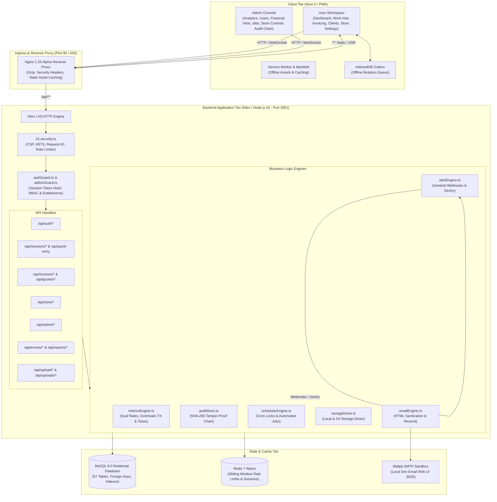
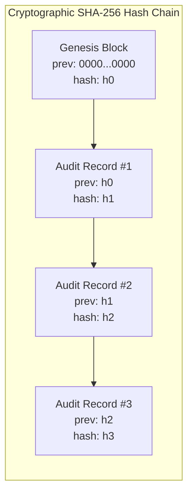
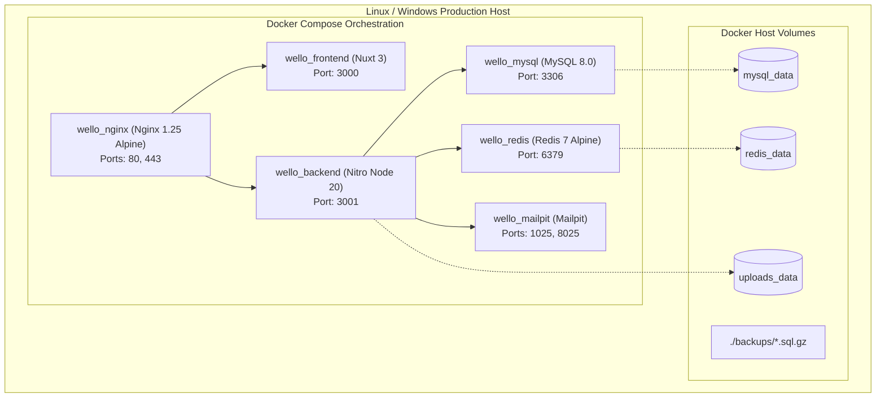

# Wello – System Architecture & Technical Specification

## 1. Executive Summary & Core Philosophy

**Wello** is a high-performance, production-hardened work-value intelligence, client management, and revenue optimization platform engineered for independent professionals, freelancers, and agencies. 

Unlike traditional time-tracking or simple invoicing tools, Wello is architected around **"Real Effective Hourly Rate"** intelligence: revealing the true economic yield of a professional's time across projects, quotes, unbilled hours, non-billable overhead (proposals, revisions, administrative work), non-project income streams, and client relationships.

```
Effective Hourly Rate = (Total Collected Revenue - Direct Project Expenses - Allocated Overhead) / Total Worked Hours (Billable + Non-Billable)
```

### Core Architectural Principles
1. **100% MySQL Relational Persistence**: Zero volatile in-memory stores; state is transactionally persisted across 57 relational tables with Knex.js migrations.
2. **Server-Authoritative Business Logic**: Timer state transitions, rate calculations, invoice state machines, and free addon entitlements are strictly validated and computed server-side.
3. **Defense-in-Depth Security & Personal Income Privacy**: Strict Zod schema validation, distributed sliding window rate limiting, dual-permission admin controls (`users.view` vs `users.financial_view`), and an immutable SHA-256 cryptographic audit hash chain.
4. **Resilient Offline-First Client Architecture**: Nuxt 3 PWA with IndexedDB outbox queue, background sync on network recovery, and bidirectional conflict resolution.
5. **Zero Paid Subscriptions / Zero Plans**: 100% free enforceable addon ecosystem configured entirely by user personas and fair-use quotas.
6. **Multi-Container Deployment Topology**: Fully containerized with Docker Compose, reverse-proxied via Nginx, and automated via manual zero-downtime deployment scripts and disaster recovery drill utilities.

---

## 2. High-Level System Topology



---

## 3. Entity-Relationship Data Model

The Wello database schema comprises **57 relational tables** organized across 6 core functional domains:

```mermaid
erDiagram
    USERS ||--o{ AUTH_SESSIONS : "authenticates"
    USERS ||--o{ WORK_SESSIONS : "records"
    USERS ||--o{ PROJECTS : "owns"
    USERS ||--o{ CLIENTS : "manages"
    USERS ||--o{ INVOICES : "issues"
    USERS ||--o{ PAYMENTS : "collects"
    USERS ||--o{ INCOME_SOURCES : "earns_from"
    USERS ||--o{ OVERHEAD_EXPENSES : "incurs"
    USERS ||--o{ USER_ADDONS : "entitled_to"
    USERS ||--o{ NOTIFICATIONS : "receives"
    USERS ||--o{ ANALYTICS_EVENTS : "triggers"
    USERS ||--o| ADMIN_USERS : "may_have_admin_role"

    PROJECTS ||--o{ WORK_SESSIONS : "contains"
    PROJECTS ||--o{ PROJECT_QUOTES : "quoted_with"
    PROJECTS ||--o{ PROJECT_EXPENSES : "incurs"
    PROJECTS ||--o{ INVOICES : "billed_via"

    INVOICES ||--o{ INVOICE_ITEMS : "contains"
    INVOICES ||--o{ INVOICE_TAXES : "applies"
    INVOICES ||--o{ PAYMENTS : "settled_by"
    INVOICES ||--o{ CREDIT_NOTES : "adjusted_by"

    WORK_SESSIONS ||--o{ WORK_SESSION_PAUSES : "paused_by"
    WORK_SESSIONS ||--o{ WORK_SESSION_EDITS : "audited_by"

    ADDONS ||--o{ USER_ADDONS : "granted_as"
    ADDONS ||--o{ ADDON_PERSONA_DEFAULTS : "defaulted_for"

    ADMIN_USERS ||--o{ ADMIN_ROLE_PERMISSIONS : "assigned_via_role"
    ADMIN_ROLES ||--o{ ADMIN_ROLE_PERMISSIONS : "has_permissions"
    ADMIN_PERMISSIONS ||--o{ ADMIN_ROLE_PERMISSIONS : "defines"

    USERS ||--o{ AUDIT_LOGS : "target_of"
    ADMIN_USERS ||--o{ AUDIT_LOGS : "actor_of"
```



### Key Table Domains
1. **Identity & Security**: `users`, `auth_sessions`, `otp_codes`, `admin_users`, `admin_roles`, `admin_permissions`, `admin_role_permissions`, `audit_logs`, `rate_limits`.
2. **Work Tracking & Dual Rates**: `work_sessions`, `work_session_pauses`, `work_session_edits`, `projects`, `project_quotes`, `project_expenses`, `clients`, `income_sources`, `overhead_expenses`.
3. **Invoicing & Billing Engine**: `invoices`, `invoice_items`, `invoice_taxes`, `invoice_sequences`, `payments`, `credit_notes`, `credit_note_items`, `recurring_invoice_profiles`, `tax_rates`, `fx_rates`.
4. **Addon Entitlements**: `addons`, `user_addons`, `addon_persona_defaults`, `fair_use_limits`, `fair_use_logs`.
5. **Analytics & Intelligence**: `analytics_events`, `analytics_daily_rollups`, `analytics_user_summaries`, `analytics_cohorts`, `analytics_funnel_definitions`, `analytics_funnel_steps`, `analytics_saved_views`, `analytics_scheduled_reports`.
6. **Platform & Operations**: `scheduler_locks`, `scheduled_jobs_log`, `data_retention_policies`, `email_logs`, `email_templates`, `notifications`, `notification_preferences`, `web_push_subscriptions`, `user_feedback`.

---

## 4. Request Lifecycle & Offline Sync

```mermaid
sequenceDiagram
    autonumber
    actor User as User / Browser (PWA)
    participant Outbox as IndexedDB Outbox
    participant Nginx as Nginx Proxy (:80)
    participant Nitro as Nitro Backend (:3001)
    participant Guard as Auth & Entitlement Guards
    participant Service as Business Logic Service
    participant DB as MySQL Database (:3306)
    participant Audit as SHA-256 Audit Engine

    alt Online Direct Request
        User->>Nginx: HTTP POST /api/quick-entry (Session Cookie / Bearer)
        Nginx->>Nitro: Proxy pass with X-Request-ID & Client IP
        Nitro->>Guard: Verify session token hash & rate limit
        Guard->>DB: SELECT user FROM auth_sessions WHERE token_hash = ?
        DB-->>Guard: Return user profile & permissions
        Guard->>Service: Execute work session / invoice transaction
        Service->>DB: INSERT / UPDATE with transactional integrity
        DB-->>Service: Commit confirmed
        Service-->>Nitro: Response payload
        Nitro-->>Nginx-->>User: 200 OK (JSON Payload)
    else Offline Request (PWA Network Disconnected)
        User->>Outbox: Enqueue mutation into IndexedDB (type, action, payload, clientTimestamp)
        Outbox-->>User: Optimistic UI update & "Offline Changes Pending" badge
        Note over User, Outbox: Network Reconnected (window.online event)
        User->>Nginx: POST /api/sync (Batch payload of pending outbox actions)
        Nginx->>Nitro: Forward batch sync request
        Nitro->>Guard: Authenticate user session
        loop For each queued item
            Nitro->>Service: Apply idempotent state transition with server timestamp resolution
            Service->>DB: Persist validated record
        end
        Nitro-->>User: 200 OK (Sync result with reconciled server IDs)
        User->>Outbox: Clear processed items & update local cache
    end
```

---

## 5. Authentication, Sessions & RBAC Security

### A. Authentication Flow
- **Passwordless OTP Authentication**: Users sign in using email OTP.
- **HMAC Hash Code Protection**: OTP codes are salted and verified with `AUTH_HMAC_SECRET`.
- **SHA-256 Session Hashing**: Tokens are never stored in plaintext. `auth_sessions` stores `token_hash = sha256(rawToken)` with automatic expiration tracking.
- **HTTP-Only Cookies**: Session tokens are transported via HTTP-only, `SameSite=Lax`, secure cookies (`wello_session`).

### B. 5-Tier RBAC Permission Matrix

| Role Key | Role Name | Allowed Permissions | Financial View Allowed? |
| :--- | :--- | :--- | :---: |
| `SUPER_ADMIN` | Super Administrator | `*` (All platform, user, and financial capabilities) | Yes (Requires Reason) |
| `ADMIN` | Administrator | `users.view`, `users.manage`, `jobs.view`, `analytics.view`, `store.manage` | No |
| `SUPPORT` | Support Specialist | `users.view`, `users.impersonate`, `feedback.view`, `feedback.manage` | No |
| `ANALYST` | Business Analyst | `analytics.view`, `analytics.export`, `jobs.view` | No |
| `MODERATOR` | Content Moderator | `jobs.view`, `jobs.moderate`, `feedback.view` | No |

### C. Personal Income Privacy & Financial View Controls
- Default admin directories show **aggregates only** (user count, active status, creation dates, masked amounts).
- Access to an individual user's quotes, invoices, payments, or revenue streams requires the `users.financial_view` permission.
- **Mandatory Justification Reason**: The administrator must provide a non-empty business justification reason with every financial view request.
- **Tamper-Evident SHA-256 Audit Chain**: Every financial view or administrative mutation writes an immutable audit block linking to the previous block's SHA-256 hash.



---

## 6. Schedulers & Background Jobs Architecture

Background tasks are managed by [`backend/utils/schedulerEngine.ts`](backend/utils/schedulerEngine.ts) with distributed database locks in MySQL (`scheduler_locks`):

| Job Name | Frequency | Engine Method | Description |
| :--- | :--- | :--- | :--- |
| **Daily Analytics Rollup** | `0 1 * * *` (01:00 UTC) | `runDailyAnalyticsRollupJob` | Computes rolling metrics, cohort distributions, and active user metrics into `analytics_daily_rollups`. |
| **User Summaries Rollup** | `0 2 * * *` (02:00 UTC) | `runUserSummaryRollupJob` | Aggregates lifetime user revenue, total hours, and effective hourly rates into `analytics_user_summaries`. |
| **Invoice Overdue Evaluator**| `0 6 * * *` (06:00 UTC) | `evaluateOverdueInvoices` | Transitions unpaid invoices past `due_date` to `OVERDUE` and dispatches automated reminder notifications. |
| **Data Retention Pruner** | `0 3 * * 0` (Weekly Sun) | `pruneExpiredRetentionData` | Enforces GDPR data retention policies, purging deleted accounts and expired logs. |
| **Database Backup Engine** | `0 4 * * *` (04:00 UTC) | `scripts/db_backup_restore.mjs` | Dumps database, computes SHA-256 checksums, and executes retention pruning. |

---

## 7. Deployment Topology



---

## 8. Complete API Route & Guard Reference

| HTTP Method | Route Endpoint | Auth Guard / RBAC | Purpose |
| :--- | :--- | :--- | :--- |
| `POST` | `/api/auth/send-otp` | Public (Rate-limited: 5/5min) | Dispatches salted OTP email |
| `POST` | `/api/auth/verify-otp` | Public (Rate-limited: 10/10min) | Validates OTP and returns session token |
| `GET` | `/api/me` | `requireUser` | Fetches active user profile & preferences |
| `PATCH` | `/api/me` | `requireUser` | Updates profile, hourly targets, & currency |
| `POST` | `/api/me/privacy` | `requireUser` | Updates privacy & telemetry consent settings |
| `POST` | `/api/me/delete-account` | `requireUser` | Schedules GDPR account soft-deletion (30d) |
| `POST` | `/api/me/cancel-deletion`| `requireUser` | Cancels pending GDPR account deletion |
| `POST` | `/api/quick-entry` | `requireUser` (Blocks Impersonation) | Unified fast entry for timers, payments, invoices |
| `POST` | `/api/timer/start` | `requireUser` (Blocks Impersonation) | Starts server-authoritative timer session |
| `POST` | `/api/timer/stop` | `requireUser` (Blocks Impersonation) | Stops timer and persists duration & income |
| `GET` | `/api/sessions` | `requireUser` | Lists historical work sessions |
| `GET` | `/api/metrics/summary` | `requireUser` | Returns dual hourly rates & variance metrics |
| `GET` | `/api/invoices` | `requireUser` | Lists user invoices with filter by status |
| `POST` | `/api/invoices` | `requireUser` (Blocks Impersonation) | Generates new invoice with line items & taxes |
| `GET` | `/api/invoices/:id` | `requireUser` | Fetches single invoice with tax breakdown |
| `DELETE` | `/api/invoices/:id` | `requireUser` (Blocks Impersonation) | Cancels or deletes draft invoice |
| `POST` | `/api/invoices/status`| `requireUser` (Blocks Impersonation) | Transitions invoice state (`SENT`, `PAID`, `VOID`) |
| `GET` | `/api/invoices/public/:token` | Public | Public client invoice viewing portal |
| `POST` | `/api/invoices/public/:token/action` | Public | Client invoice approval / payment submission |
| `GET` | `/api/quotes/public/:token` | Public | Public client quote viewing portal |
| `POST` | `/api/quotes/public/:token/action` | Public | Client quote approval / rejection |
| `GET` | `/api/income-sources` | `requireUser` | Lists recurring non-project income streams |
| `POST` | `/api/income-sources` | `requireUser` (Blocks Impersonation) | Creates non-project income stream |
| `GET` | `/api/overhead-expenses` | `requireUser` | Lists recurring overhead expenses |
| `POST` | `/api/overhead-expenses` | `requireUser` (Blocks Impersonation) | Creates monthly/annual overhead expense |
| `GET` | `/api/store/addons` | `requireUser` | Lists available free addon catalog |
| `POST` | `/api/store/addons/activate` | `requireUser` | Activates free addon for user account |
| `GET` | `/api/export` | `requireUser` | Exports complete user data bundle (JSON/CSV) |
| `POST` | `/api/upload/logo` | `requireUser` (Magic-byte guarded) | Uploads invoice branding logo |
| `GET` | `/api/uploads/:filename` | Public (Cached) | Securely serves uploaded business assets |
| `GET` | `/api/admin/users` | `requirePermission('users.view')` | Lists users (omits individual financials) |
| `GET` | `/api/admin/users/:id/financials` | `requirePermission('users.financial_view')` + Reason | Fetches user financial records with audit log |
| `POST` | `/api/admin/users/impersonate` | `requirePermission('users.impersonate')` + Reason | Initiates 15-minute read-only support session |
| `GET` | `/api/admin/audit-logs` | `requirePermission('audit.view')` | Lists audit trail with cryptographic hashes |
| `GET` | `/api/admin/audit-logs/verify` | `requirePermission('audit.view')` | Validates complete SHA-256 audit chain |
| `GET` | `/api/admin/jobs` | `requirePermission('jobs.view')` | Lists jobs overview (amounts masked by default) |
| `POST` | `/api/admin/jobs/moderate` | `requirePermission('jobs.moderate')` | Flags or resolves job moderation status |
| `GET` | `/api/health` | Public | Liveness probe returning 200 & memory stats |
| `GET` | `/api/ready` | Public | Readiness probe checking MySQL connection pool |

---

## 9. Related Engineering Documentation
- [Metrics & Formula Reference](METRICS.md)
- [Security & Privacy Architecture](SECURITY.md)
- [Deployment, Containers & Disaster Recovery](DEPLOYMENT.md)
- [Comprehensive API Reference](API.md)
- [Analytics Engine & Funnel Catalogue](ANALYTICS.md)
