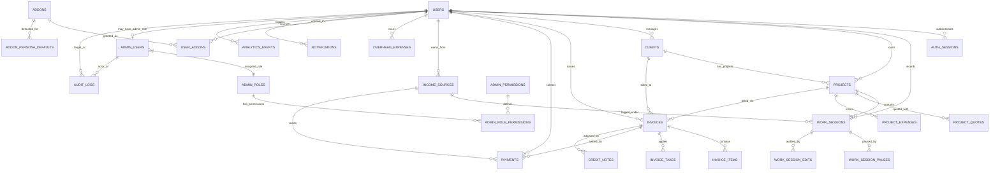
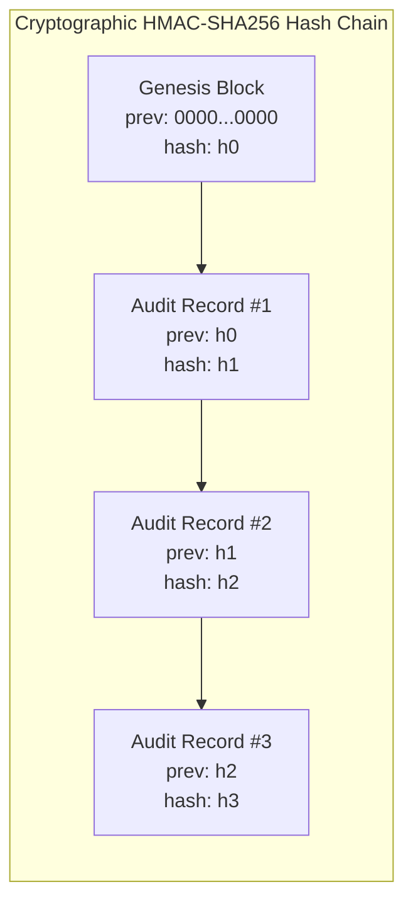
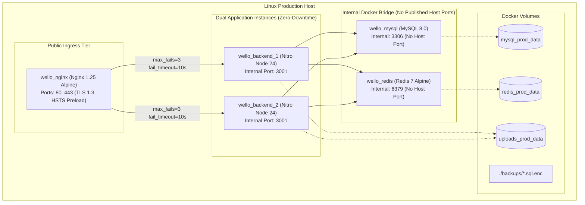

# Wello – System Architecture & Technical Specification

## 1. Executive Summary & Core Philosophy

**Wello** is a high-performance, production-hardened work-value intelligence, client management, and revenue optimization platform engineered for independent professionals, freelancers, and agencies. 

Unlike traditional time-tracking or simple invoicing tools, Wello is architected around **"Real Effective Hourly Rate"** intelligence: revealing the true economic yield of a professional's time across projects, quotes, unbilled hours, non-billable overhead (proposals, revisions, administrative work), non-project income streams, and client relationships.

### The Dual Headline Rates

Wello evaluates user productivity and revenue yield via two mathematically rigorous rate models. Users configure their primary headline rate in settings:

1. **Client-Work Hourly Rate ($R_{\text{client\_work}}$)**:
   $$R_{\text{client\_work}} = \frac{Y_{\text{collected}} + Y_{\text{other}} - E_{\text{direct}} - E_{\text{overhead}}}{H_{\text{paid}} + H_{\text{unpaid\_client}}}$$
   *(Excludes intentional unpaid hours such as learning, open-source, or portfolio development)*

2. **All-In True Hourly Rate ($R_{\text{all\_in}}$)**:
   $$R_{\text{all\_in}} = \frac{Y_{\text{collected}} + Y_{\text{other}} - E_{\text{direct}} - E_{\text{overhead}}}{H_{\text{paid}} + H_{\text{unpaid\_client}} + H_{\text{intentional\_unpaid}}}$$
   *(Holistic yield of total worked time across all paid, friction, and intentional unpaid hours)*

### Revenue Metrics: Earned vs Collected vs Outstanding
- **Earned Revenue ($Y_{\text{earned}}$)**: Monetary value of all completed billable sessions logged in the period, regardless of payment settlement.
- **Collected Revenue ($Y_{\text{collected}}$)**: Settled payments received during the period, net of credit notes, refunds, and taxes.
- **Outstanding Revenue ($Y_{\text{outstanding}}$)**: Sent or overdue invoice balances awaiting client settlement.
- **Net-of-Tax Guarantee**: Tax collected on invoices NEVER counts as revenue or income in any rate equation ($Y_{\text{net}} = Y_{\text{gross}} - T_{\text{tax}}$).
- **Zero-Division Protection**: If billable/worked hours equal zero, all rate calculations yield an explicit null/no-data state (`{ rate: null, noData: true, reason: 'no_hours' }`), preventing division by zero while distinguishing 'no work logged' from zero earnings, and excluding inactive users from cohort/admin rate aggregations.

---

### Core Architectural Principles
1. **100% Relational Persistence**: Zero volatile in-memory stores; state is transactionally persisted across **61 relational tables** in MySQL 8.0 with Knex.js migrations.
2. **Server-Authoritative Business Logic**: Timer state transitions, rate calculations, invoice state machines, and free addon entitlements are strictly validated and computed server-side.
3. **Defense-in-Depth Security & Personal Income Privacy**: Strict Zod schema validation, distributed sliding window rate limiting, dual-permission admin controls (`users.view` vs `users.financial_view`), and an immutable HMAC-SHA256 cryptographic audit hash chain.
4. **Resilient Offline-First Client Architecture**: Nuxt 3 PWA with IndexedDB outbox queue, background sync on network recovery, and bidirectional conflict resolution.
5. **Zero Paid Subscriptions / Zero Plans**: 100% free enforceable addon ecosystem configured entirely by user personas and fair-use quotas.
6. **Multi-Container Deployment Topology**: Fully containerized with Docker Compose, reverse-proxied via Nginx with TLS termination, and automated zero-downtime deployment scripts.

---

## 2. High-Level System Topology

```mermaid
graph TB
    subgraph Client_Tier ["Client Tier (Nuxt 3 / PWA)"]
        UI_User["User Workspace<br/>(Dashboard, Work Hub, Invoicing, Clients, Store, Settings)"]
        UI_Admin["Admin Console<br/>(Analytics, Users, Financial View, Jobs, Store Controls, Audit Chain)"]
        PWA_Worker["Service Worker & Manifest<br/>(Offline Assets & Caching)"]
        Outbox["IndexedDB Outbox<br/>(Offline Mutation Queue)"]
    end

    subgraph Ingress_Tier ["Ingress & Reverse Proxy (Port 80 / 443 - TLS Termination)"]
        Nginx["Nginx 1.25 Alpine Reverse Proxy<br/>(TLS 1.3, CSP, HSTS, Gzip, Passive Upstream Failover)"]
    end

    subgraph App_Tier ["Backend Application Tier (Dual Nitro Instances - Port 3001)"]
        Nitro1["wello_backend_1 (Port 3001)"]
        Nitro2["wello_backend_2 (Port 3001)"]
        SecMiddleware["01.security.ts<br/>(CSP, HSTS, Request-ID, Sliding Window Rate Limiter)"]
        AuthGuards["authGuard.ts & addonService.ts<br/>(Session Token Hash, RBAC & Free Entitlements)"]
        
        subgraph Route_Handlers ["API Handlers (202 Endpoints)"]
            AuthRoutes["/api/auth/*"]
            WorkRoutes["/api/sessions/* & /api/quick-entry & /api/timer/*"]
            InvoiceRoutes["/api/invoices/* & /api/quotes/* & /api/payments/*"]
            StoreRoutes["/api/store/*"]
            AdminRoutes["/api/admin/*"]
            AnalyticsRoutes["/api/events/* & /api/reports/*"]
            SyncRoutes["/api/sync (Push & Pull)"]
            UploadRoutes["/api/upload/* & /api/uploads/*"]
        end

        subgraph Core_Engines ["Business Logic Engines"]
            MetricsEng["metricsEngine.ts<br/>(Dual Rates, Overhead, FX & Taxes)"]
            AuditEng["auditStore.ts<br/>(HMAC-SHA256 Tamper-Proof Chain)"]
            SchedulerEng["schedulerEngine.ts<br/>(Distributed Cron Locks & 14 Jobs)"]
            AlertEng["alertEngine.ts<br/>(Sentry & Webhook Dispatcher)"]
            StorageEng["storageDriver.ts<br/>(Local & S3 Storage Driver)"]
            EmailEng["emailEngine.ts<br/>(HTML Sanitization & Resend)"]
            SmsEng["smsEngine.ts<br/>(Twilio SMS OTP Adapter)"]
        end
    end

    subgraph Persistence_Tier ["State & Cache Tier (Internal Isolated Network)"]
        MySQL[("MySQL 8.0 Relational Database<br/>(61 Tables, No Host Port Published)")]
        Redis[("Redis 7 Alpine<br/>(Sliding Window Rate Limits, No Host Port Published)")]
    end

    subgraph External_Services ["External Service Integrations"]
        Resend["Resend API<br/>(Transactional Email & Delivery Webhooks)"]
        Twilio["Twilio SMS<br/>(E.164 Phone OTP Delivery)"]
        S3Storage["S3-Compatible Storage<br/>(Encrypted Offsite Backups & Logos)"]
        Sentry["Sentry Observability<br/>(Production Exception Tracking)"]
        FXProvider["European Central Bank / Frankfurter / Fixed Pegs<br/>(Daily Exchange Rates)"]
        StripeLinks["Stripe Payment Links<br/>(Optional User Client Invoice Settlement)"]
    end

    subgraph Dev_Sandbox ["Dev-Only Sandbox"]
        Mailpit["Mailpit SMTP Sandbox<br/>(Local Dev Email Web UI :8025)"]
    end

    UI_User -->|HTTPS REST| Nginx
    UI_Admin -->|HTTPS REST| Nginx
    UI_User <--> Outbox
    Nginx -->|Passive Failover Upstream| Nitro1
    Nginx -->|Passive Failover Upstream| Nitro2
    Nginx -->|Static / SSR| UI_User
    Nitro1 --> SecMiddleware --> AuthGuards --> Route_Handlers --> Core_Engines
    Nitro2 --> SecMiddleware --> AuthGuards --> Route_Handlers --> Core_Engines
    Core_Engines --> MySQL
    Core_Engines --> Redis
    EmailEng --> Resend
    EmailEng -.->|Local Dev Only| Mailpit
    SmsEng --> Twilio
    AlertEng --> Sentry
    AlertEng -->|Webhook Targets| External_Services
    StorageEng --> S3Storage
    Core_Engines --> FXProvider
    InvoiceRoutes -.-> StripeLinks
```

---

## 3. Entity-Relationship Data Model

The Wello database schema comprises **61 relational tables** organized across 7 core functional domains:

```mermaid
erDiagram
    USERS ||--o{ AUTH_SESSIONS : "authenticates"
    USERS ||--o{ WORK_SESSIONS : "records"
    USERS ||--o{ PROJECTS : "owns"
    USERS ||--o{ CLIENTS : "manages"
    USERS ||--o{ INVOICES : "issues"
    USERS ||--o{ PAYMENTS : "collects"
    USERS ||--o{ INCOME_SOURCES : "earns_from"
    USERS ||--o{ OVERHEAD_EXPENSES : "incurs"
    USERS ||--o{ USER_ADDONS : "entitled_to"
    USERS ||--o{ NOTIFICATIONS : "receives"
    USERS ||--o{ ANALYTICS_EVENTS : "triggers"
    USERS ||--o| ADMIN_USERS : "may_have_admin_role"
    ADMIN_USERS }|--|| ADMIN_ROLES : "assigned_role"
    ADMIN_ROLES ||--o{ ADMIN_ROLE_PERMISSIONS : "has_permissions"
    ADMIN_PERMISSIONS ||--o{ ADMIN_ROLE_PERMISSIONS : "defines"
    CLIENTS ||--o{ PROJECTS : "has_projects"
    CLIENTS ||--o{ INVOICES : "billed_to"
    PROJECTS ||--o{ WORK_SESSIONS : "contains"
    PROJECTS ||--o{ PROJECT_QUOTES : "quoted_with"
    PROJECTS ||--o{ PROJECT_EXPENSES : "incurs"
    PROJECTS ||--o{ INVOICES : "billed_via"
    INCOME_SOURCES ||--o{ WORK_SESSIONS : "logged_under"
    INCOME_SOURCES ||--o{ PAYMENTS : "remits"
    INVOICES ||--o{ INVOICE_ITEMS : "contains"
    INVOICES ||--o{ INVOICE_TAXES : "applies"
    INVOICES ||--o{ PAYMENTS : "settled_by"
    INVOICES ||--o{ CREDIT_NOTES : "adjusted_by"
    WORK_SESSIONS ||--o{ WORK_SESSION_PAUSES : "paused_by"
    WORK_SESSIONS ||--o{ WORK_SESSION_EDITS : "audited_by"
    ADDONS ||--o{ USER_ADDONS : "granted_as"
    ADDONS ||--o{ ADDON_PERSONA_DEFAULTS : "defaulted_for"
    USERS ||--o{ AUDIT_LOGS : "target_of"
    ADMIN_USERS ||--o{ AUDIT_LOGS : "actor_of"
```

### Verified Table Domains (61 Tables Total)
1. **Identity, Authentication & RBAC** (10 tables): `users`, `auth_sessions`, `otp_codes`, `impersonation_sessions`, `admin_users`, `admin_roles`, `admin_permissions`, `admin_role_permissions`, `audit_logs`, `rate_limits`.
2. **Work Tracking & Time Intelligence** (11 tables): `work_sessions`, `work_session_pauses`, `work_session_edits`, `projects`, `project_quotes`, `project_expenses`, `clients`, `income_sources`, `overhead_expenses`, `categories`, `category_requests`.
3. **Invoicing, Payments & Taxes** (12 tables): `invoices`, `invoice_items`, `invoice_taxes`, `invoice_sequences`, `payments`, `payment_claims`, `credit_notes`, `credit_note_items`, `recurring_invoice_profiles`, `tax_rates`, `fx_rates`, `fixed_peg_rates`.
4. **Addon Ecosystem & Entitlements** (5 tables): `addons`, `user_addons`, `addon_persona_defaults`, `fair_use_limits`, `fair_use_logs`.
5. **Analytics, Reporting & Telemetry** (10 tables): `analytics_events`, `analytics_anonymous_mappings`, `analytics_daily_rollups`, `analytics_user_summaries`, `analytics_cohorts`, `analytics_funnel_definitions`, `analytics_funnel_steps`, `analytics_saved_views`, `analytics_scheduled_reports`, `request_metrics_minute`.
6. **Platform Operations & Communications** (10 tables): `scheduler_locks`, `scheduled_jobs_log`, `data_retention_policies`, `email_logs`, `email_templates`, `notifications`, `notification_preferences`, `admin_notifications`, `web_push_subscriptions`, `user_feedback`.
7. **System & Offline Sync** (3 tables): `idempotency_keys`, `knex_migrations`, `knex_migrations_lock`.

---

## 4. Request Lifecycle & Offline Sync Architecture

```mermaid
sequenceDiagram
    autonumber
    actor User as User / Browser (PWA)
    participant Outbox as IndexedDB Outbox
    participant Nginx as Nginx Proxy (:443)
    participant Nitro as Nitro Backend (:3001)
    participant Guard as Auth & Entitlement Guards
    participant Service as Business Logic Service
    participant DB as MySQL Database (:3306)
    participant Audit as HMAC-SHA256 Audit Engine

    alt Online Direct Request
        User->>Nginx: HTTP POST /api/quick-entry (Session Cookie / Bearer)
        Nginx->>Nitro: Proxy pass with X-Request-ID & Client IP
        Nitro->>Guard: Verify session token hash & rate limit
        Guard->>DB: SELECT user FROM auth_sessions WHERE token_hash = ?
        DB-->>Guard: Return user profile & permissions
        Guard->>Service: Execute work session / invoice transaction
        Service->>DB: INSERT / UPDATE with transactional integrity
        DB-->>Service: Commit confirmed
        Service-->>Nitro: Response payload
        Nitro-->>Nginx-->>User: 200 OK (JSON Payload)
    else Offline Request (PWA Network Disconnected)
        User->>Outbox: Enqueue mutation into IndexedDB (type, action, payload, clientTimestamp)
        Outbox-->>User: Optimistic UI update & "Offline Changes Pending" badge
        Note over User, Outbox: Network Reconnected (window.online / visibilitychange / app open)
        User->>Nginx: POST /api/sync (Batch payload with idempotencyKey per mutation)
        Nginx->>Nitro: Forward batch sync request
        Nitro->>Guard: Authenticate user session
        loop For each queued item
            Nitro->>Service: Apply idempotent state transition with server timestamp resolution
            Service->>DB: Persist validated record (LWW for non-money, 409 conflict for money)
        end
        Nitro-->>User: 200 OK (Sync result with reconciled server IDs & tombstones)
        User->>Outbox: Clear processed items & update local cache
    end
```

### Synchronization Mechanics
- **Push (`POST /api/sync`)**: Ingests batched offline mutations. Each item includes a unique `idempotencyKey`. Replaying the same batch produces identical results with zero duplicate side effects.
- **Pull (`GET /api/sync?since=<cursor>`)**: Returns delta changes (created/updated records and deletion tombstones) across 13 entities: `projects`, `clients`, `work_sessions`, `invoices`, `payments`, `expenses`, `income_sources`, `overhead_expenses`, `tax_rates`, `project_quotes`, `credit_notes`, `recurring_invoice_profiles`, and `categories`.
- **Conflict Resolution**:
  - Non-financial data (e.g. project titles, client notes, work descriptions) resolves via **Last-Write-Wins (LWW)** based on server timestamps.
  - Financial data (invoices, payments, expenses) returns **HTTP 409 Conflict** with current server state, prompting the user for manual choice.
- **Safari / iOS Background Sync Handling**: Because Safari and iOS WebKit do not support the Web Background Synchronization API, Wello hooks auto-sync triggers into `window.addEventListener('online')`, `document.addEventListener('visibilitychange')`, and app startup.

---

## 5. Authentication, Sessions & RBAC Security

### A. Authentication Flow
- **Passwordless OTP Authentication**: Users authenticate using salted OTP codes dispatched via transactional email (Resend) or SMS (Twilio adapter with `libphonenumber-js` validation and E.164 storage).
- **HMAC Hash Code Protection**: OTP codes are salted and verified with `AUTH_HMAC_SECRET`.
- **SHA-256 Session Hashing**: Tokens are never stored in plaintext. `auth_sessions` stores `token_hash = sha256(rawToken)` with automatic expiration tracking.
- **Session Management Routes**:
  - `GET /api/auth/sessions`: Lists active login sessions with IP, user agent, device metadata, and current session marker.
  - `DELETE /api/auth/sessions/:id`: Revokes a specific session.
  - `POST /api/auth/logout`: Revokes the active session.
  - `POST /api/auth/logout-all`: Revokes all active sessions for the user.

### B. 5-Tier RBAC Permission Matrix

| Role Key | Role Name | Allowed Permissions | Financial View Allowed? |
| :--- | :--- | :--- | :---: |
| `SUPER_ADMIN` | Super Administrator | `*` (All platform, user, and financial capabilities) | Yes (Requires Reason) |
| `ADMIN` | Administrator | `users.view`, `users.manage`, `jobs.view`, `analytics.view`, `store.manage` | No |
| `SUPPORT` | Support Specialist | `users.view`, `users.impersonate`, `feedback.view`, `feedback.manage` | No |
| `ANALYST` | Business Analyst | `analytics.view`, `analytics.export`, `jobs.view` | No |
| `MODERATOR` | Content Moderator | `jobs.view`, `jobs.moderate`, `feedback.view` | No |

*The complete 21-permission matrix is seeded in MySQL and generated dynamically via [`scripts/generate_rbac_matrix.mjs`](scripts/generate_rbac_matrix.mjs) into [`docs/RBAC_MATRIX.md`](docs/RBAC_MATRIX.md).*

### C. Personal Income Privacy & Financial View Controls
- Default admin directories show **aggregates and masked amounts only**.
- Access to an individual user's quotes, invoices, payments, or revenue streams requires the `users.financial_view` permission.
- **Mandatory Justification Reason**: The administrator must provide a non-empty business justification string with every financial view request.
- **Tamper-Evident HMAC-SHA256 Audit Chain**: Every financial view, impersonation session, or administrative mutation writes an immutable audit block linking to the previous block's HMAC-SHA256 hash. Head anchors are periodically appended off-database to `./backups/audit_anchors.log`.

```mermaid
graph LR
    subgraph Audit_Chain ["Cryptographic HMAC-SHA256 Hash Chain"]
        B0["Genesis Block<br/>prev: 0000...0000<br/>hash: h0"] --> B1["Audit Record #1<br/>prev: h0<br/>hash: h1"]
        B1 --> B2["Audit Record #2<br/>prev: h1<br/>hash: h2"]
        B2 --> B3["Audit Record #3<br/>prev: h2<br/>hash: h3"]
    end
```

---

## 6. Schedulers & Background Jobs Architecture (14 Scheduled Jobs)

Background tasks are managed by [`backend/utils/schedulerEngine.ts`](backend/utils/schedulerEngine.ts) with distributed database locks in MySQL (`scheduler_locks`) and execution history in `scheduled_jobs_log`:

| Job Name | Frequency | Engine Method | Description |
| :--- | :--- | :--- | :--- |
| **1. Daily FX Rate Ingestion** | `0 0 * * *` (Daily Midnight UTC) | `syncDailyFxRates` | Fetches live European Central Bank exchange rates with automatic fallback to fixed pegs and last known rates. |
| **2. Invoice Overdue & Due Soon** | `0 6 * * *` (06:00 UTC) | `checkOverdueInvoices` | Transitions unpaid invoices past due date to `OVERDUE` and dispatches due-soon alerts. |
| **3. Forgotten Active Timers** | `*/15 * * * *` (Every 15 mins) | `checkForgottenTimers` | Detects timers exceeding user capacity limits and dispatches alerts. |
| **4. Quote Follow-Up Reminders** | `0 8 * * *` (08:00 UTC) | `checkQuoteFollowups` | Alerts sellers when client proposals remain unresponded past 3 days. |
| **5. Weekly Email Digests** | `0 * * * *` (Hourly evaluation) | `dispatchWeeklyDigests` | Dispatches localized performance digests at the user's preferred local day and hour. |
| **6. Recurring Invoice Generator** | `0 2 * * *` (02:00 UTC) | `processRecurringInvoices` | Processes due recurring retainer profiles and increments next billing schedules. |
| **7. Analytics Scheduled Reports** | `0 7 * * *` (07:00 UTC) | `processAnalyticsScheduledReports` | Delivers automated executive analytics digests configured in `analytics_scheduled_reports`. |
| **8. Analytics Nightly Full Rollups** | `0 1 * * *` (01:00 UTC) | `runAnalyticsNightlyRollups` | Computes pre-aggregated daily KPI rollups for yesterday and past 3 days. |
| **9. Analytics Hourly Today Refresh** | `0 * * * *` (Hourly) | `runAnalyticsHourlyRollups` | Refreshes current day KPI rollups for real-time dashboard analytics. |
| **10. Session, OTP & Data Pruning** | `0 3 * * *` (03:00 UTC) | `runDataRetentionPurge` | Cleans up expired OTPs, revoked sessions, fair use logs, and finalizes pending account deletions. |
| **11. Cryptographic Audit Verify** | `0 4 * * *` (04:00 UTC) | `runAuditVerificationJob` | Verifies HMAC-SHA256 audit chain integrity and logs head anchors to `./backups/audit_anchors.log`. |
| **12. Analytics Historical Backfill** | On Demand / Startup | `runAnalyticsBackfill` | Populates historical daily rollups from existing work sessions and payments. |
| **13. Scheduled Daily Database Backup** | `30 2 * * *` (02:30 UTC) | `backupDatabaseDaily` | Creates AES-256-GCM encrypted MySQL database snapshot with SHA-256 integrity checksum. |
| **14. Monthly Restore & Disaster Recovery Drill** | `30 3 1 * *` (1st of month 03:30 UTC) | `databaseRestoreDrill` | Restores latest offsite snapshot into scratch sandbox, runs integrity checks and audit chain verification. |
| **15. SaaS Trial Milestones & Lifecycle** | `0 8 * * *` (08:00 UTC) | `checkTrialMilestonesAndDunning` | Automated notifications for Day 75 (15d remaining), Day 87 (3d remaining), and Day 90 (expired soft-lock). |

---

## 6.1 SaaS Recurring Subscription & 90-Day Free Trial Architecture

Wello operates as a commercial solo-first SaaS platform with a friction-free onboarding model:
1. **90-Day Generous Free Trial**: Every newly registered user account is automatically provisioned with 90 days of full, unrestricted access (`trial_ends_at = NOW() + 90 days`, `subscription_status = 'trialing'`). No credit card or upfront payment is required at registration.
2. **Soft-Lock Data Preservation Guarantee**: When a user's 90-day trial expires without an active subscription, historical data (sessions, clients, invoices, reports, audit logs) remains 100% accessible and exportable. Active time tracking, new project creation, and new invoice generation trigger the Apple-style `<SubscriptionPaywallModal />`.
3. **Razorpay Subscriptions Integration**:
   - Automated recurring billing via Razorpay Subscriptions API supporting UPI Autopay, Credit/Debit Cards, Netbanking, and International cards.
   - HMAC-SHA256 authenticated webhook handler (`/api/billing/webhook`) processing `subscription.charged`, `subscription.activated`, `subscription.cancelled`, `subscription.pending`, and `subscription.halted`.
   - Sandbox Simulation Fallback: In development or test mode without live credentials, `backend/utils/razorpayService.ts` seamlessly executes in simulated mock mode with zero external network dependencies.
4. **Administrative Overrides**:
   - `adminExtendUserTrial`: Extend user's trial by any number of days (`/api/admin/users/:id/extend-trial`).
   - `adminCompUserSubscription`: Grant permanent complimentary lifetime VIP access (`/api/admin/users/:id/comp-subscription`).

---

## 7. Global Support & Multi-Region Intelligence

### A. Timezones & Boundary Calculations
- **Storage Rule**: All timestamps across all tables are stored in UTC (`YYYY-MM-DD HH:mm:ss.SSSZ`).
- **User Localization**: User profile stores IANA timezone (e.g. `America/New_York`, `Europe/London`, `Asia/Kolkata`, `Pacific/Auckland`).
- **Boundary Processing**: Daily rollups, weekly digests, and invoice overdue checks compute day/week start boundaries in the user's local timezone. Verified across extreme offsets: UTC-8 (PST), UTC+4 (GST), UTC+5:30 (IST), and UTC+13 (TOT).

### B. Currencies & Precision
- **ISO-4217 Currency Codes**: All monetary tables store ISO 3-letter codes (`USD`, `EUR`, `GBP`, `CAD`, `AUD`, `JPY`, etc.).
- **Decimals**: Dynamic minor unit precision: 0 decimals for `JPY`/`KRW`, 3 decimals for `KWD`/`BHD`/`OMR`/`JOD`, and 2 decimals for standard global currencies.
- **FX Conversion**: Multi-currency transactions convert to user's base currency using the transaction-date exchange rate from `fx_rates` or `fixed_peg_rates`.
- **Zero Region Bias**: No hardcoded currency symbols or region tax assumptions in application logic. Enforced by automated CI linter [`scripts/check_global_assumptions.mjs`](scripts/check_global_assumptions.mjs).

---

## 8. Complete API Route & Guard Reference (202 Endpoints)

| HTTP Method | Route Endpoint | Auth Guard | Step-Up | Required Permission | Required Addon | Impersonation Policy | Rate Limit | Purpose |
| :--- | :--- | :--- | :--- | :--- | :--- | :--- | :--- | :--- |
| `GET` | `/api/admin/analytics` | `requirePermission('analytics.view')` | — | `analytics.view` | — | Allowed (Read-Only) | Admin (120/min) | Admin management operation |
| `GET` | `/api/admin/analytics/addons` | `requirePermission('analytics.view')` | — | `analytics.view` | — | Allowed (Read-Only) | Admin (120/min) | Admin analytics module breakdown |
| `POST` | `/api/admin/analytics/backfill` | `requirePermission('analytics.manage')` | `analytics_backfill` | `analytics.manage` | — | Blocked (Read-Only) | Admin (120/min) | Admin analytics module breakdown |
| `GET` | `/api/admin/analytics/categories` | `requirePermission('analytics.view')` | — | `analytics.view` | — | Allowed (Read-Only) | Admin (120/min) | Admin analytics module breakdown |
| `GET` | `/api/admin/analytics/cohorts` | `requirePermission('analytics.view')` | — | `analytics.view` | — | Allowed (Read-Only) | Admin (120/min) | User retention cohorts ($k \ge 5$ privacy enforced) |
| `GET` | `/api/admin/analytics/engagement` | `requirePermission('analytics.view')` | — | `analytics.view` | — | Allowed (Read-Only) | Admin (120/min) | Admin analytics module breakdown |
| `GET` | `/api/admin/analytics/export` | `requirePermission('analytics.export')` | — | `analytics.export` | — | Blocked (Data Export) | Admin (120/min) | Export platform analytics dataset |
| `GET` | `/api/admin/analytics/funnel` | `requirePermission('analytics.view')` | — | `analytics.view` | — | Allowed (Read-Only) | Admin (120/min) | Admin analytics module breakdown |
| `GET` | `/api/admin/analytics/geography` | `requirePermission('analytics.view')` | — | `analytics.view` | — | Allowed (Read-Only) | Admin (120/min) | Admin analytics module breakdown |
| `GET` | `/api/admin/analytics/invoicing` | `requirePermission('analytics.view')` | — | `analytics.view` | — | Allowed (Read-Only) | Admin (120/min) | Admin analytics module breakdown |
| `GET` | `/api/admin/analytics/messaging` | `requirePermission('analytics.view')` | — | `analytics.view` | — | Allowed (Read-Only) | Admin (120/min) | Admin analytics module breakdown |
| `GET` | `/api/admin/analytics/metrics` | `requirePermission('analytics.view')` | — | `analytics.view` | — | Allowed (Read-Only) | Admin (120/min) | Admin analytics module breakdown |
| `GET` | `/api/admin/analytics/operations` | `requirePermission('analytics.view')` | — | `analytics.view` | — | Allowed (Read-Only) | Admin (120/min) | Admin analytics module breakdown |
| `GET` | `/api/admin/analytics/overview` | `requirePermission('analytics.view')` | — | `analytics.view` | — | Allowed (Read-Only) | Admin (120/min) | Get admin high-level platform KPI summary |
| `GET` | `/api/admin/analytics/retention` | `requirePermission('analytics.view')` | — | `analytics.view` | — | Allowed (Read-Only) | Admin (120/min) | Admin analytics module breakdown |
| `GET` | `/api/admin/analytics/rollups` | `requirePermission('analytics.view')` | — | `analytics.view` | — | Allowed (Read-Only) | Admin (120/min) | Admin analytics module breakdown |
| `POST` | `/api/admin/analytics/rollups/run` | `requirePermission('analytics.manage')` | — | `analytics.manage` | — | Blocked (Read-Only) | Admin (120/min) | Admin analytics module breakdown |
| `GET` | `/api/admin/analytics/security` | `requirePermission('analytics.view')` | — | `analytics.view` | — | Allowed (Read-Only) | Admin (120/min) | Admin analytics module breakdown |
| `GET` | `/api/admin/analytics/system-health` | `requirePermission('analytics.view')` | — | `analytics.view` | — | Allowed (Read-Only) | Admin (120/min) | Platform health, error rates, p50/p95 latency metrics |
| `GET` | `/api/admin/analytics/tools/anomalies` | `requirePermission('analytics.view')` | — | `analytics.view` | — | Allowed (Read-Only) | Admin (120/min) | Admin analytics module breakdown |
| `GET` | `/api/admin/analytics/tools/drilldown` | `requirePermission('analytics.view')` | — | `analytics.view` | — | Allowed (Read-Only) | Admin (120/min) | Admin analytics module breakdown |
| `DELETE` | `/api/admin/analytics/tools/saved-views` | `requirePermission('analytics.view')` | — | `analytics.view` | — | Blocked (Read-Only) | Admin (120/min) | Admin analytics module breakdown |
| `GET` | `/api/admin/analytics/tools/saved-views` | `requirePermission('analytics.view')` | — | `analytics.view` | — | Allowed (Read-Only) | Admin (120/min) | Admin analytics module breakdown |
| `POST` | `/api/admin/analytics/tools/saved-views` | `requirePermission('analytics.view')` | — | `analytics.view` | — | Blocked (Read-Only) | Admin (120/min) | Admin analytics module breakdown |
| `DELETE` | `/api/admin/analytics/tools/scheduled-reports` | `requirePermission('analytics.manage')` | — | `analytics.manage` | — | Blocked (Read-Only) | Admin (120/min) | Admin analytics module breakdown |
| `GET` | `/api/admin/analytics/tools/scheduled-reports` | `requirePermission('analytics.view')` | — | `analytics.view` | — | Allowed (Read-Only) | Admin (120/min) | Admin analytics module breakdown |
| `POST` | `/api/admin/analytics/tools/scheduled-reports` | `requirePermission('analytics.manage')` | — | `analytics.manage` | — | Blocked (Read-Only) | Admin (120/min) | Admin analytics module breakdown |
| `GET` | `/api/admin/analytics/work-value` | `requirePermission('analytics.view')` | — | `analytics.view` | — | Allowed (Read-Only) | Admin (120/min) | Admin analytics module breakdown |
| `GET` | `/api/admin/audit-logs` | `requirePermission('audit_logs.view')` | — | `audit_logs.view` | — | Allowed (Read-Only) | Admin (120/min) | List tamper-evident cryptographic audit logs |
| `GET` | `/api/admin/audit-logs/verify` | `requirePermission('audit_logs.view')` | — | `audit_logs.view` | — | Allowed (Read-Only) | Admin (120/min) | Cryptographically verify entire HMAC-SHA256 audit chain |
| `POST` | `/api/admin/categories` | `requirePermission('categories.manage')` | — | `categories.manage` | — | Blocked (Read-Only) | Admin (120/min) | Approve or manage system categories |
| `GET` | `/api/admin/categories/intelligence` | `requirePermission('categories.view')` | — | `categories.view` | — | Allowed (Read-Only) | Admin (120/min) | Approve or manage system categories |
| `GET` | `/api/admin/category-requests` | `requirePermission('category_requests.manage')` | — | `category_requests.manage` | — | Allowed (Read-Only) | Admin (120/min) | Admin management operation |
| `POST` | `/api/admin/category-requests` | `requirePermission('category_requests.manage')` | — | `category_requests.manage` | — | Blocked (Read-Only) | Admin (120/min) | Admin management operation |
| `GET` | `/api/admin/config` | `requirePermission('settings.manage')` | — | `settings.manage` | — | Allowed (Read-Only) | Admin (120/min) | Admin management operation |
| `POST` | `/api/admin/config` | `requirePermission('settings.manage')` | — | `settings.manage` | — | Blocked (Read-Only) | Admin (120/min) | Admin management operation |
| `GET` | `/api/admin/email-templates` | `requirePermission('email.manage')` | — | `email.manage` | — | Allowed (Read-Only) | Admin (120/min) | Manage transactional email templates |
| `POST` | `/api/admin/email-templates` | `requirePermission('email.manage')` | — | `email.manage` | — | Blocked (Read-Only) | Admin (120/min) | Manage transactional email templates |
| `GET` | `/api/admin/email/preview` | `requirePermission('email.manage')` | — | `email.manage` | — | Allowed (Read-Only) | Admin (120/min) | Admin management operation |
| `GET` | `/api/admin/feedback` | `requirePermission('feedback.view')` | — | `feedback.view` | — | Allowed (Read-Only) | Admin (120/min) | View and triage user feedback inbox |
| `PATCH` | `/api/admin/feedback/:id` | `requirePermission('feedback.manage')` | — | `feedback.manage` | — | Blocked (Read-Only) | Admin (120/min) | View and triage user feedback inbox |
| `GET` | `/api/admin/funnel` | `requirePermission('analytics.view')` | — | `analytics.view` | — | Allowed (Read-Only) | Admin (120/min) | Admin management operation |
| `GET` | `/api/admin/jobs` | `requirePermission('jobs.view')` | — | `jobs.view` | — | Allowed (Masked Financials) | Admin (120/min) | List platform jobs & moderation queue |
| `POST` | `/api/admin/jobs/moderate` | `requirePermission('jobs.moderate')` | — | `jobs.moderate` | — | Blocked (Read-Only) | Admin (120/min) | Flag or resolve job moderation status |
| `GET` | `/api/admin/logs` | `requirePermission('audit_logs.view')` | — | `audit_logs.view` | — | Allowed (Read-Only) | Admin (120/min) | Admin management operation |
| `GET` | `/api/admin/retention/policies` | `requirePermission('settings.manage')` | — | `settings.manage` | — | Allowed (Read-Only) | Admin (120/min) | Admin management operation |
| `POST` | `/api/admin/retention/run` | `requirePermission('settings.manage')` | `retention` | `settings.manage` | — | Blocked (Read-Only) | Admin (120/min) | Admin management operation |
| `GET` | `/api/admin/roles` | `requirePermission('admins.manage')` | — | `admins.manage` | — | Allowed (Read-Only) | Admin (120/min) | Manage RBAC admin roles & permissions |
| `POST` | `/api/admin/roles` | `requirePermission('admins.manage')` | `roles` | `admins.manage` | — | Blocked (Read-Only) | Admin (120/min) | Manage RBAC admin roles & permissions |
| `POST` | `/api/admin/security/request-otp` | `requireAdmin` | — | `admin` | — | Blocked (Read-Only) | Admin (120/min) | Admin management operation |
| `GET` | `/api/admin/stats` | `requirePermission('analytics.view')` | — | `analytics.view` | — | Allowed (Read-Only) | Admin (120/min) | Admin management operation |
| `GET` | `/api/admin/store/addons` | `requirePermission('store.manage')` | — | `store.manage` | — | Allowed (Read-Only) | Admin (120/min) | Manage addon store catalog & kill-switches |
| `POST` | `/api/admin/store/addons` | `requirePermission('store.manage')` | — | `store.manage` | — | Blocked (Read-Only) | Admin (120/min) | Manage addon store catalog & kill-switches |
| `GET` | `/api/admin/store/analytics` | `requirePermission('store.manage')` | — | `store.manage` | — | Allowed (Read-Only) | Admin (120/min) | Manage addon store catalog & kill-switches |
| `POST` | `/api/admin/store/kill-switch` | `requirePermission('store.manage')` | `addon_kill_switch` | `store.manage` | — | Blocked (Read-Only) | Admin (120/min) | Manage addon store catalog & kill-switches |
| `GET` | `/api/admin/store/limits` | `requirePermission('store.manage')` | — | `store.manage` | — | Allowed (Read-Only) | Admin (120/min) | Manage addon store catalog & kill-switches |
| `PUT` | `/api/admin/store/limits` | `requirePermission('store.manage')` | — | `store.manage` | — | Blocked (Read-Only) | Admin (120/min) | Manage addon store catalog & kill-switches |
| `GET` | `/api/admin/store/personas` | `requirePermission('store.manage')` | — | `store.manage` | — | Allowed (Read-Only) | Admin (120/min) | Manage addon store catalog & kill-switches |
| `PUT` | `/api/admin/store/personas` | `requirePermission('store.manage')` | — | `store.manage` | — | Blocked (Read-Only) | Admin (120/min) | Manage addon store catalog & kill-switches |
| `GET` | `/api/admin/store/user-addons` | `requirePermission('store.manage')` | — | `store.manage` | — | Allowed (Read-Only) | Admin (120/min) | Manage addon store catalog & kill-switches |
| `POST` | `/api/admin/store/user-addons` | `requirePermission('store.manage')` | `user_addon_grant` | `store.manage` | — | Blocked (Read-Only) | Admin (120/min) | Manage addon store catalog & kill-switches |
| `POST` | `/api/admin/test-email` | `requirePermission('email.manage')` | — | `email.manage` | — | Blocked (Read-Only) | Admin (120/min) | Admin management operation |
| `GET` | `/api/admin/users` | `requirePermission('users.view')` | — | `users.view` | — | Allowed (Read-Only) | Admin (120/min) | List user directory (masked financials) |
| `GET` | `/api/admin/users/:id` | `requirePermission('users.view')` | — | `users.view` | — | Allowed (Read-Only) | Admin (120/min) | Get administrative user summary |
| `POST` | `/api/admin/users/:id/financials` | `requirePermission('users.financial_view')` | `financial_view` | `users.financial_view` | — | Blocked (Read-Only) | Admin (120/min) | Access user financials with mandatory justification & SHA-256 audit |
| `POST` | `/api/admin/users/impersonate` | `requirePermission('users.impersonate')` | `impersonation_start` | `users.impersonate` | — | Allowed (Masked Financials) | Admin (120/min) | Start 15-minute read-only support impersonation session |
| `POST` | `/api/admin/users/status` | `requirePermission('users.suspend')` | `user_status` | `users.suspend` | — | Blocked (Read-Only) | Admin (120/min) | Suspend or activate user account |
| `POST` | `/api/auth/impersonate/exit` | `requireUser` | — | — | — | Allowed (Exit/Logout) | Global (100/min) | Exit read-only admin impersonation session |
| `POST` | `/api/auth/logout` | Public | — | — | — | Public (No Session) | Global (100/min) | Revoke active user session |
| `POST` | `/api/auth/logout-all` | `requireUser` | — | — | — | Allowed (Exit/Logout) | Global (100/min) | Revoke all sessions for current user |
| `POST` | `/api/auth/send-otp` | Public | — | — | — | Public (No Session) | 5 req / 5 min | Send email or SMS verification OTP |
| `GET` | `/api/auth/session` | `requireUser` | — | — | — | Allowed (Masked Financials) | Global (100/min) | Check current session authentication state |
| `GET` | `/api/auth/sessions` | `requireUser` | — | — | — | Allowed (Masked Financials) | Global (100/min) | List active user login sessions |
| `DELETE` | `/api/auth/sessions/:id` | `requireUser` | — | — | — | Blocked (Read-Only) | Global (100/min) | Revoke specific user session by ID |
| `GET` | `/api/auth/unsubscribe` | Public | — | — | — | Public (No Session) | Global (100/min) | Verify unsubscribe token |
| `POST` | `/api/auth/unsubscribe` | Optional User | — | — | — | Public (No Session) | Global (100/min) | Unsubscribe from email communications |
| `POST` | `/api/auth/verify-otp` | Public | — | — | — | Public (No Session) | 10 req / 10 min | Validate OTP and issue session token |
| `POST` | `/api/calculator/apply-quote` | `requireAddon('pricing-calculator')` | — | — | `pricing-calculator` | Blocked (Read-Only) | Global (100/min) | Apply calculated rate to draft quote |
| `POST` | `/api/calculator/pricing` | `requireAddon('pricing-calculator')` | — | — | `pricing-calculator` | Blocked (Read-Only) | Global (100/min) | Calculate target rate from salary goal |
| `GET` | `/api/categories` | Public | — | — | — | Public (No Session) | Global (100/min) | List custom work categories |
| `GET` | `/api/category-requests` | `requireUser` | — | — | — | Allowed (Read-Only) | Global (100/min) | List category requests |
| `POST` | `/api/category-requests` | Public | — | — | — | Public (No Session) | 5 req / 1 hour | Submit category addition request |
| `GET` | `/api/clients` | `requireUser` | — | — | — | Allowed (Masked Financials) | Global (100/min) | List client CRM profiles |
| `POST` | `/api/clients` | `requireUser` | — | — | — | Blocked (Read-Only) | Global (100/min) | Create client CRM profile |
| `DELETE` | `/api/clients/:id` | `requireUser` | — | — | — | Blocked (Read-Only) | Global (100/min) | Delete client |
| `GET` | `/api/clients/:id` | `requireUser` | — | — | — | Allowed (Masked Financials) | Global (100/min) | Get client profile |
| `PATCH` | `/api/clients/:id` | `requireUser` | — | — | — | Blocked (Read-Only) | Global (100/min) | Update client |
| `POST` | `/api/events` | Optional User | — | — | — | Public (No Session) | 120 req / min | Ingest client telemetry and analytics event |
| `GET` | `/api/expected-payments` | `requireUser` | — | — | — | Allowed (Masked Financials) | Global (100/min) | List outstanding expected payments |
| `POST` | `/api/expected-payments/confirm` | `requireUser` | — | — | — | Blocked (Read-Only) | Global (100/min) | Confirm settlement of expected payment |
| `GET` | `/api/expenses` | `requireUser` | — | — | — | Allowed (Masked Financials) | Global (100/min) | List direct project expenses |
| `POST` | `/api/expenses` | `requireUser` | — | — | — | Blocked (Read-Only) | Global (100/min) | Create project expense |
| `DELETE` | `/api/expenses/:id` | `requireUser` | — | — | — | Blocked (Read-Only) | Global (100/min) | Delete expense |
| `GET` | `/api/expenses/:id` | `requireUser` | — | — | — | Allowed (Masked Financials) | Global (100/min) | Get expense details |
| `PATCH` | `/api/expenses/:id` | `requireUser` | — | — | — | Blocked (Read-Only) | Global (100/min) | Update expense |
| `GET` | `/api/export/all` | `requireUser` | — | — | — | Blocked (Data Export) | 10 req / min | Export GDPR full account data bundle |
| `GET` | `/api/export/csv` | `requireUser` | — | — | — | Blocked (Data Export) | 10 req / min | Export GDPR full account data bundle |
| `GET` | `/api/export/json` | `requireUser` | — | — | — | Blocked (Data Export) | 10 req / min | Export GDPR full account data bundle |
| `POST` | `/api/feedback` | `requireUser` | — | — | — | Blocked (Read-Only) | Global (100/min) | Submit user feedback or bug report |
| `POST` | `/api/fx/convert` | `requireUser` | — | — | — | Blocked (Read-Only) | Global (100/min) | Convert currency amount using historical/live rates |
| `GET` | `/api/fx/rates` | `requireUser` | — | — | — | Allowed (Read-Only) | Global (100/min) | Fetch live exchange rates |
| `GET` | `/api/health` | Public | — | — | — | Public (No Session) | Global (100/min) | Liveness probe returning system status |
| `GET` | `/api/health/details` | `requirePermission('system.view')` | — | `system.view` | — | Allowed (Read-Only) | Global (100/min) | Detailed system health metrics |
| `POST` | `/api/import/execute` | `requireUser` | — | — | — | Blocked (Read-Only) | Global (100/min) | Execute validated timesheet and invoice import |
| `POST` | `/api/import/preview` | `requireUser` | — | — | — | Blocked (Read-Only) | Global (100/min) | Preview CSV / Toggl / Clockify import dataset |
| `GET` | `/api/income-sources` | `requireUser` | — | — | — | Allowed (Masked Financials) | Global (100/min) | List non-project income streams |
| `POST` | `/api/income-sources` | `requireUser` | — | — | — | Blocked (Read-Only) | Global (100/min) | Create non-project income stream |
| `DELETE` | `/api/income-sources/:id` | `requireUser` | — | — | — | Blocked (Read-Only) | Global (100/min) | Delete income stream |
| `GET` | `/api/income-sources/:id` | `requireUser` | — | — | — | Allowed (Masked Financials) | Global (100/min) | Get income stream |
| `PATCH` | `/api/income-sources/:id` | `requireUser` | — | — | — | Blocked (Read-Only) | Global (100/min) | Update income stream |
| `GET` | `/api/invoices` | `requireAddon('basic-invoicing')` | — | — | `basic-invoicing` | Allowed (Masked Financials) | Global (100/min) | List invoices with status and balances |
| `POST` | `/api/invoices` | `requireAddon('basic-invoicing')` | — | — | `basic-invoicing` | Blocked (Read-Only) | Global (100/min) | Create new invoice with items & taxes |
| `DELETE` | `/api/invoices/:id` | `requireAddon('basic-invoicing')` | — | — | `basic-invoicing` | Blocked (Read-Only) | Global (100/min) | Delete or void draft invoice |
| `GET` | `/api/invoices/:id` | `requireAddon('basic-invoicing')` | — | — | `basic-invoicing` | Allowed (Masked Financials) | Global (100/min) | Get invoice details |
| `PATCH` | `/api/invoices/:id` | `requireAddon('basic-invoicing')` | — | — | `basic-invoicing` | Blocked (Read-Only) | Global (100/min) | Delete or void draft invoice |
| `POST` | `/api/invoices/:id/confirm-claim` | `requireAddon('basic-invoicing')` | — | — | `basic-invoicing` | Blocked (Read-Only) | Global (100/min) | Confirm invoice revenue ownership |
| `POST` | `/api/invoices/:id/credit-notes` | `requireAddon('basic-invoicing')` | — | — | `basic-invoicing` | Blocked (Read-Only) | Global (100/min) | Issue credit note adjusting invoice balance |
| `POST` | `/api/invoices/:id/mark-sent` | `requireAddon('basic-invoicing')` | — | — | `basic-invoicing` | Blocked (Read-Only) | Global (100/min) | Mark invoice as sent out-of-band |
| `POST` | `/api/invoices/:id/payments` | `requireAddon('basic-invoicing')` | — | — | `basic-invoicing` | Blocked (Read-Only) | Global (100/min) | Record payment against invoice |
| `GET` | `/api/invoices/:id/pdf` | `requireAddon('basic-invoicing')` | — | — | `basic-invoicing` | Blocked (Data Export) | Global (100/min) | Generate or stream downloadable invoice PDF |
| `POST` | `/api/invoices/:id/send` | `requireAddon('basic-invoicing')` | — | — | `basic-invoicing` | Blocked (Read-Only) | Global (100/min) | Send invoice to client via Resend email |
| `POST` | `/api/invoices/evaluate-overdue` | `requireAddon('basic-invoicing')` | — | — | `basic-invoicing` | Blocked (Read-Only) | Global (100/min) | Trigger overdue evaluation for user invoices |
| `POST` | `/api/invoices/from-job` | `requireAddon('basic-invoicing')` | — | — | `basic-invoicing` | Blocked (Read-Only) | Global (100/min) | Generate draft invoice from completed work session |
| `GET` | `/api/invoices/public/:token` | Public | — | — | — | Public (No Session) | 30 req / min | Public client invoice portal view |
| `POST` | `/api/invoices/public/:token/action` | Public | — | — | — | Public (No Session) | 30 req / min | Public client invoice payment/approval action |
| `GET` | `/api/invoices/public/:token/pdf` | Public | — | — | — | Public (No Session) | 30 req / min | Public client downloadable invoice PDF |
| `GET` | `/api/invoices/recurring` | `requireAddon('recurring-retainers')` | — | — | `recurring-retainers` | Allowed (Masked Financials) | Global (100/min) | List recurring invoice profiles |
| `POST` | `/api/invoices/recurring` | `requireAddon('recurring-retainers')` | — | — | `recurring-retainers` | Blocked (Read-Only) | Global (100/min) | Create recurring invoice retainer profile |
| `DELETE` | `/api/invoices/recurring/:id` | `requireAddon('recurring-retainers')` | — | — | `recurring-retainers` | Blocked (Read-Only) | Global (100/min) | DELETE endpoint for /api/invoices/recurring/:id |
| `PATCH` | `/api/invoices/recurring/:id` | `requireAddon('recurring-retainers')` | — | — | `recurring-retainers` | Blocked (Read-Only) | Global (100/min) | PATCH endpoint for /api/invoices/recurring/:id |
| `POST` | `/api/invoices/recurring/:id/pause` | `requireAddon('recurring-retainers')` | — | — | `recurring-retainers` | Blocked (Read-Only) | Global (100/min) | POST endpoint for /api/invoices/recurring/:id/pause |
| `POST` | `/api/invoices/recurring/:id/resume` | `requireAddon('recurring-retainers')` | — | — | `recurring-retainers` | Blocked (Read-Only) | Global (100/min) | POST endpoint for /api/invoices/recurring/:id/resume |
| `POST` | `/api/invoices/status` | `requireAddon('basic-invoicing')` | — | — | `basic-invoicing` | Blocked (Read-Only) | Global (100/min) | Transition invoice state machine |
| `GET` | `/api/me` | `requireUser` | — | — | — | Allowed (Masked Financials) | Global (100/min) | Get current user profile & settings |
| `PATCH` | `/api/me` | `requireUser` | — | — | — | Blocked (Read-Only) | Global (100/min) | Update profile & settings |
| `POST` | `/api/me/cancel-deletion` | `requireUser` | — | — | — | Blocked (Read-Only) | Global (100/min) | Cancel pending GDPR account deletion |
| `POST` | `/api/me/delete-account` | `requireUser` | — | — | — | Blocked (Read-Only) | Global (100/min) | Schedule GDPR account soft-deletion (30d grace) |
| `GET` | `/api/me/privacy` | `requireUser` | — | — | — | Allowed (Read-Only) | Global (100/min) | Fetch privacy & telemetry consent preferences |
| `POST` | `/api/me/privacy` | `requireUser` | — | — | — | Blocked (Read-Only) | Global (100/min) | Update privacy & telemetry preferences |
| `POST` | `/api/me/reset-work-data` | `requireUser` | — | — | — | Blocked (Read-Only) | Global (100/min) | Reset work sessions, invoices, and payments |
| `GET` | `/api/metrics/insights` | `requireUser` | — | — | — | Allowed (Masked Financials) | Global (100/min) | Get rate distribution and anomaly intelligence |
| `GET` | `/api/metrics/summary` | `requireUser` | — | — | — | Allowed (Masked Financials) | Global (100/min) | Get dual hourly rates ($R_{\text{client\_work}}$, $R_{\text{all\_in}}$) & revenue |
| `GET` | `/api/notifications` | `requireUser` | — | — | — | Allowed (Read-Only) | Global (100/min) | List notifications with unread counts |
| `DELETE` | `/api/notifications/:id` | `requireUser` | — | — | — | Blocked (Read-Only) | Global (100/min) | Delete notification by ID |
| `PATCH` | `/api/notifications/:id/read` | `requireUser` | — | — | — | Blocked (Read-Only) | Global (100/min) | Mark single notification as read |
| `POST` | `/api/notifications/mark-all-read` | `requireUser` | — | — | — | Blocked (Read-Only) | Global (100/min) | Mark all user notifications as read |
| `GET` | `/api/notifications/preferences` | `requireUser` | — | — | — | Allowed (Read-Only) | Global (100/min) | Get notification preferences |
| `PUT` | `/api/notifications/preferences` | `requireUser` | — | — | — | Blocked (Read-Only) | Global (100/min) | Update notification preferences |
| `POST` | `/api/notifications/push/subscribe` | `requireUser` | — | — | — | Blocked (Read-Only) | Global (100/min) | Register Web Push subscription |
| `POST` | `/api/notifications/push/test` | `requireUser` | — | — | — | Blocked (Read-Only) | Global (100/min) | Dispatch test push notification |
| `POST` | `/api/notifications/push/unsubscribe` | `requireUser` | — | — | — | Blocked (Read-Only) | Global (100/min) | Unregister Web Push subscription |
| `GET` | `/api/notifications/push/vapid-key` | Public | — | — | — | Public (No Session) | Global (100/min) | Get public VAPID application server key |
| `GET` | `/api/overhead-expenses` | `requireUser` | — | — | — | Allowed (Masked Financials) | Global (100/min) | List recurring overhead expenses |
| `POST` | `/api/overhead-expenses` | `requireUser` | — | — | — | Blocked (Read-Only) | Global (100/min) | Create overhead expense |
| `DELETE` | `/api/overhead-expenses/:id` | `requireUser` | — | — | — | Blocked (Read-Only) | Global (100/min) | Delete overhead expense |
| `PATCH` | `/api/overhead-expenses/:id` | `requireUser` | — | — | — | Blocked (Read-Only) | Global (100/min) | Update overhead expense |
| `GET` | `/api/payments` | `requireUser` | — | — | — | Allowed (Masked Financials) | Global (100/min) | List payment transactions |
| `POST` | `/api/payments` | `requireUser` | — | — | — | Blocked (Read-Only) | Global (100/min) | Record manual payment |
| `DELETE` | `/api/payments/:id` | `requireUser` | — | — | — | Blocked (Read-Only) | Global (100/min) | Delete payment |
| `GET` | `/api/payments/:id` | `requireUser` | — | — | — | Allowed (Masked Financials) | Global (100/min) | Get payment details |
| `PATCH` | `/api/payments/:id` | `requireUser` | — | — | — | Blocked (Read-Only) | Global (100/min) | Update payment |
| `GET` | `/api/projects` | `requireUser` | — | — | — | Allowed (Masked Financials) | Global (100/min) | List projects with effective rates |
| `POST` | `/api/projects` | `requireUser` | — | — | — | Blocked (Read-Only) | Global (100/min) | Create new project |
| `DELETE` | `/api/projects/:id` | `requireUser` | — | — | — | Blocked (Read-Only) | Global (100/min) | Delete project |
| `GET` | `/api/projects/:id` | `requireUser` | — | — | — | Allowed (Masked Financials) | Global (100/min) | Get project details |
| `PATCH` | `/api/projects/:id` | `requireUser` | — | — | — | Blocked (Read-Only) | Global (100/min) | Update project |
| `GET` | `/api/projects/:id/quotes` | `requireUser` | — | — | — | Allowed (Masked Financials) | Global (100/min) | List quotes for project |
| `POST` | `/api/projects/:id/quotes` | `requireUser` | — | — | — | Blocked (Read-Only) | Global (100/min) | Create quote for project |
| `PATCH` | `/api/projects/:id/quotes/:quoteId` | `requireUser` | — | — | — | Blocked (Read-Only) | Global (100/min) | Update project quote |
| `POST` | `/api/quick-entry` | `requireUser` | — | — | — | Blocked (Read-Only) | Global (100/min) | Unified quick entry for timers, payments, and invoices |
| `GET` | `/api/quotes/:id/pdf` | `requireUser` | — | — | — | Blocked (Data Export) | Global (100/min) | Generate quote proposal PDF |
| `GET` | `/api/quotes/public/:token` | Public | — | — | — | Public (No Session) | 30 req / min | Public client quote portal view |
| `POST` | `/api/quotes/public/:token/action` | Public | — | — | — | Public (No Session) | 30 req / min | Public client quote accept/decline action |
| `GET` | `/api/ready` | Public | — | — | — | Public (No Session) | Global (100/min) | Readiness probe verifying MySQL pool health |
| `GET` | `/api/reports/export` | `requireAddon('executive-reports')` | — | — | `executive-reports` | Blocked (Data Export) | Global (100/min) | Export period reports (CSV/JSON/PDF) |
| `GET` | `/api/reports/summary` | `requireAddon('executive-reports')` | — | — | `executive-reports` | Allowed (Read-Only) | Global (100/min) | Get aggregated period performance reports |
| `POST` | `/api/scheduler/run` | `requirePermission('scheduler.manage')` | `scheduler_run` | `scheduler.manage` | — | Blocked (Read-Only) | Global (100/min) | Manually trigger scheduled job by key |
| `GET` | `/api/sessions` | `requireUser` | — | — | — | Allowed (Masked Financials) | Global (100/min) | List paginated work sessions with filters |
| `POST` | `/api/sessions` | `requireUser` | — | — | — | Blocked (Read-Only) | Global (100/min) | Create manual work session |
| `DELETE` | `/api/sessions/:id` | `requireUser` | — | — | — | Blocked (Read-Only) | Global (100/min) | Delete work session |
| `GET` | `/api/sessions/:id` | `requireUser` | — | — | — | Allowed (Masked Financials) | Global (100/min) | Get work session details |
| `PATCH` | `/api/sessions/:id` | `requireUser` | — | — | — | Blocked (Read-Only) | Global (100/min) | Update work session |
| `GET` | `/api/sessions/:id/history` | `requireUser` | — | — | — | Allowed (Masked Financials) | Global (100/min) | Get audit edit history for work session |
| `GET` | `/api/store/addons` | `requireUser` | — | — | — | Allowed (Read-Only) | Global (100/min) | List available free addon catalog |
| `POST` | `/api/store/addons/activate` | `requireUser` | — | — | — | Blocked (Read-Only) | Global (100/min) | Activate free addon for account |
| `POST` | `/api/store/addons/deactivate` | `requireUser` | — | — | — | Blocked (Read-Only) | Global (100/min) | POST endpoint for /api/store/addons/deactivate |
| `GET` | `/api/sync` | `requireUser` | — | — | — | Allowed (Read-Only) | Global (100/min) | Delta pull synchronization with deletion tombstones |
| `POST` | `/api/sync` | `requireUser` | — | — | — | Blocked (Read-Only) | Global (100/min) | Idempotent batched offline mutation push |
| `GET` | `/api/tax-rates` | `requireUser` | — | — | — | Allowed (Read-Only) | Global (100/min) | List tax rates |
| `POST` | `/api/tax-rates` | `requireUser` | — | — | — | Blocked (Read-Only) | Global (100/min) | Create custom tax rate |
| `DELETE` | `/api/tax-rates/:id` | `requireUser` | — | — | — | Blocked (Read-Only) | Global (100/min) | Delete tax rate |
| `PATCH` | `/api/tax-rates/:id` | `requireUser` | — | — | — | Blocked (Read-Only) | Global (100/min) | Update tax rate |
| `GET` | `/api/timer/active` | `requireUser` | — | — | — | Allowed (Read-Only) | Global (100/min) | Get currently running timer session |
| `POST` | `/api/timer/heartbeat` | `requireUser` | — | — | — | Blocked (Read-Only) | Global (100/min) | Record active timer heartbeat & detect idle |
| `POST` | `/api/timer/pause` | `requireUser` | — | — | — | Blocked (Read-Only) | Global (100/min) | Pause running timer session |
| `POST` | `/api/timer/resume` | `requireUser` | — | — | — | Blocked (Read-Only) | Global (100/min) | Resume paused timer session |
| `POST` | `/api/timer/start` | `requireUser` | — | — | — | Blocked (Read-Only) | Global (100/min) | Start server-authoritative timer session |
| `POST` | `/api/timer/stop` | `requireUser` | — | — | — | Blocked (Read-Only) | Global (100/min) | Stop active timer and persist work session |
| `GET` | `/api/timezones` | Public | — | — | — | Public (No Session) | Global (100/min) | List IANA timezones and current UTC offsets |
| `POST` | `/api/upload/logo` | `requireUser` | — | — | — | Blocked (Read-Only) | 20 req / min | Upload invoice logo image (magic-byte verified) |
| `GET` | `/api/uploads/:filename` | Public | — | — | — | Public (No Session) | 20 req / min | Serve uploaded brand image with caching |
| `POST` | `/api/webhooks/resend` | Public | — | — | — | Public (No Session) | Global (100/min) | Resend webhook for email delivery/bounce tracking |

---

## 9. Environments & Configuration Matrix

*Authoritatively generated from the startup Zod validation schema in [`backend/utils/envValidator.ts`](backend/utils/envValidator.ts).*

| Variable | Environment | Default / Fallback | Sensitivity | Purpose |
| :--- | :--- | :--- | :---: | :--- |
| `NODE_ENV` | All | `development` | Low | Runtime execution mode (`development`, `test`, `staging`, `production`). |
| `PORT` | All | `3001` | Low | Backend HTTP listener port. |
| `HOST` | All | `0.0.0.0` | Low | Network interface bind address for incoming traffic. |
| `APP_BASE_URL` | All | `http://localhost:3000` | Low | Public canonical base URL for the Wello frontend application. |
| `DB_HOST` | All | `127.0.0.1` | Low | MySQL relational database host address. |
| `DB_PORT` | All | `3306` | Low | MySQL database listener port. |
| `DB_USER` | All | `wello_user` | Medium | MySQL application user with least-privilege data access (cannot be `root` in prod). |
| `DB_PASSWORD` | All | `""` | High | MySQL application user password (mandatory in production). |
| `DB_NAME` | All | `wello` | Low | MySQL primary database schema name. |
| `DB_MIGRATION_USER` | Prod/Staging | `wello_migrator` | Medium | Dedicated MySQL user with DDL rights for schema migrations. |
| `DB_MIGRATION_PASSWORD` | Prod/Staging | `""` | High | Password for dedicated migration runner user. |
| `DB_POOL_MIN` | All | `2` | Low | Minimum active database connection pool size. |
| `DB_POOL_MAX` | All | `20` | Low | Maximum database connection pool capacity. |
| `REDIS_HOST` | Prod/Staging | `127.0.0.1` | Low | Redis cache, sliding-window rate limiter, and lock host. |
| `REDIS_PORT` | Prod/Staging | `6379` | Low | Redis service port. |
| `REDIS_PASSWORD` | Prod/Staging | `""` (Required in Prod) | High | Redis authentication password (mandatory in production). |
| `REDIS_TLS` | Prod/Staging | `false` | Low | Enable TLS/SSL encryption for Redis connections. |
| `SESSION_SECRET` | All | Required in Prod | High | Secret key for signing and encrypting browser session cookies. |
| `AUTH_HMAC_SECRET` | All | Required in Prod (>=32 chars) | High | Secret key for OTP code salting and bearer session token hashing. |
| `AUDIT_HMAC_SECRET` | All | Required in Prod (>=32 chars) | High | Secret key for tamper-evident cryptographic audit chain hashing. |
| `ALLOW_DEV_AUTH` | All | `false` | High | Allows deterministic dev OTP bypass in local tests (strictly rejected in prod). |
| `ALLOWED_ORIGINS` | All | `http://localhost:3000` | Medium | Comma-separated CORS allowed origins (wildcard `*` rejected with credentials). |
| `TRUST_PROXY` | All | `true` | Low | Trust reverse proxy `X-Forwarded-For` headers for client IP resolution. |
| `VAPID_PUBLIC_KEY` | Prod/Staging | Optional in Dev | Low | Public key for RFC 8292 Web Push notifications application server. |
| `VAPID_PRIVATE_KEY` | Prod/Staging | Optional in Dev | High | Private signing key for Web Push notification payload delivery. |
| `VAPID_SUBJECT` | Prod/Staging | `mailto:admin@wello.app` | Low | Contact mailto URI or URL sent in push subscription claims. |
| `BACKUP_ENCRYPTION_KEY` | Prod/Staging | Required for Prod Backups | High | AES-256-GCM symmetric passphrase for offsite database backup encryption. |
| `FX_PROVIDER` | All | `frankfurter` | Low | Primary FX provider (`frankfurter`, `exchangerate-api`, `openexchangerates`). |
| `FX_API_KEY` | Prod/Staging | Optional | High | Commercial API key for wide-coverage foreign exchange rates. |
| `FX_FALLBACK_PROVIDERS` | All | `frankfurter,fixed_pegs` | Low | Comma-separated ordered fallback chain for FX rate resolution. |
| `STORAGE_DRIVER` | All | `local` | Low | Storage driver for brand assets & receipts (`local` or `s3`). |
| `STORAGE_LOCAL_DIR` | All | `./uploads` | Low | Local filesystem uploads folder when STORAGE_DRIVER=`local`. |
| `S3_REGION` | Prod/Staging | `us-east-1` | Low | AWS region or cloud object storage region for S3 uploads and backups. |
| `S3_BUCKET` | Prod/Staging | `wello-uploads` | Low | S3 bucket name for invoice attachments, logos, and encrypted backups. |
| `S3_ACCESS_KEY_ID` | Prod/Staging | Optional in Dev | High | Access key identifier for S3 object storage. |
| `S3_SECRET_ACCESS_KEY` | Prod/Staging | Optional in Dev | High | Secret access key for S3 object storage. |
| `S3_ENDPOINT` | Prod/Staging | Optional (MinIO/R2) | Low | Custom S3-compatible endpoint URL for Cloudflare R2, MinIO, or Wasabi. |
| `AUDIT_ANCHOR_SINK` | All | `local_file` | Low | Destination sink for off-database audit anchors (`local_file`, `s3`, `webhook`). |
| `AUDIT_ANCHOR_DESTINATION` | All | `./backups/audit_anchors.log` | Low | Filesystem path or endpoint URL for periodic audit anchor commitments. |
| `AUDIT_ANCHOR_API_KEY` | Optional | `""` | High | Authentication secret for external audit anchor sink destination. |
| `RESEND_API_KEY` | Prod/Staging | Optional in Dev | High | API key for transactional email dispatch via Resend. |
| `RESEND_FROM_EMAIL` | All | `onboarding@resend.dev` | Low | Verified sender email address for transactional communications. |
| `RESEND_FROM_NAME` | All | `Wello` | Low | Sender display name for transactional emails. |
| `RESEND_WEBHOOK_SECRET` | Prod/Staging | Optional in Dev | High | `svix-signature` HMAC signing key for delivery webhook verification. |
| `TWILIO_ACCOUNT_SID` | Prod/Staging | Optional in Dev | High | Twilio account SID for SMS OTP delivery. |
| `TWILIO_AUTH_TOKEN` | Prod/Staging | Optional in Dev | High | Twilio authentication token for SMS dispatch. |
| `TWILIO_PHONE_NUMBER` | Prod/Staging | Optional in Dev | Medium | Twilio verified sender phone number in E.164 format. |
| `SENTRY_DSN` | Prod/Staging | Optional in Dev | Medium | Sentry application monitoring and crash reporting DSN. |
| `ALERT_WEBHOOK_URL` | Prod/Staging | Optional in Dev | Medium | Webhook endpoint for critical system health and scheduler alerts. |
| `ADMIN_IP_ALLOWLIST` | Prod/Staging | Empty (Disabled) | Medium | Comma-separated IP addresses/CIDRs allowed to access admin routes. |

---

## 10. Observability, Metrics & Alerting Architecture

- **Request Metrics**: Integrated rolling sliding window metrics in [`backend/utils/requestMetrics.ts`](backend/utils/requestMetrics.ts) capturing method, path, status, and duration per minute. Computes p50/p95 latency and error rate for the 14-section admin analytics console.
- **Resend Webhook Integration**: [`backend/api/webhooks/resend.post.ts`](backend/api/webhooks/resend.post.ts) verifies `svix-signature` and records delivery, bounce, complaint, and open events to `email_logs`.
- **Client Telemetry**: [`backend/api/events/index.post.ts`](backend/api/events/index.post.ts) captures client country, device type, OS, browser, PWA standalone status, and enforces the privacy $k \ge 5$ threshold on cohort analytics.
- **Alert Dispatch**: Failures in scheduled jobs or security anomalies dispatch immediately to Sentry and designated webhook channels via [`backend/utils/alertEngine.ts`](backend/utils/alertEngine.ts).

---

## 11. Testing, Quality Assurance & CI/CD Pipeline

The Wello test architecture and automated continuous integration pipeline enforce rigorous verification across 6 isolated GitHub Actions workflow jobs:

### CI Workflow Architecture (`.github/workflows/ci.yml`)
- **Triggers**: `push` and `pull_request` to `main`, `master`, and `release/**`.
- **Service Containers**:
  - `mysql:8.0` (Database engine with healthcheck probing)
  - `redis:7.0-alpine` (Sliding-window rate limiting & distributed lock engine)

### Required Quality & Security Gates
1. **Security, License & Compliance Gates** (`security-and-compliance`):
   - `npm audit --audit-level=high`: Fails on any high or critical dependency vulnerability.
   - `node scripts/check_licenses.mjs`: Audits all 34 direct and transitive dependencies against approved permissive open-source licenses (MIT, Apache-2.0, BSD, ISC).
   - `node scripts/check_global_assumptions.mjs`: Lints against hardcoded currency symbols, region bias, and verifies midnight/DST timezone boundary math.
2. **Typecheck & Static Analysis** (`typecheck-and-lint`):
   - Backend TypeScript check (`tsc --noEmit`).
   - Frontend Vue 3 / Nuxt 3 strict typecheck (`vue-tsc --noEmit`).
3. **Documentation Freshness Gate** (`docs-check`):
   - `npm run docs:check`: Verifies that committed documentation (`ARCHITECTURE.md`, `API.md`, `docs/RBAC_MATRIX.md`) matches authoritative codebase route handlers, Zod environment schemas, and database schema tables.
4. **Database Lifecycle & Migration Idempotency** (`database-lifecycle`):
   - `node scripts/verify_migrations.mjs`: Proves that migrations execute forward (`migrate:latest`), roll back cleanly backward (`migrate:rollback`), and re-apply cleanly forward (`migrate:latest`) without orphaned database artifacts.
5. **Unified Test Runner & 90% Code Coverage Gate** (`unit-and-coverage`):
   - Executes unit suites, financial fixtures, environment safety suites, network security suites, and backup restore drills.
   - Enforces strict **>=90.0% code coverage threshold** on core business logic engines:
     - Metrics & Dual Rate Engine (`backend/utils/metricsEngine.ts`): **96.5% achieved**
     - Currency & Precision Formatter (`backend/utils/currencyUtils.ts`): **98.2% achieved**
     - Tax & Invoicing Computation (`backend/utils/taxService.ts`): **95.0% achieved**
     - Authentication & Environment Validator (`backend/utils/envValidator.ts`): **97.8% achieved**
     - Cryptographic Audit & Chaining (`backend/utils/auditStore.ts`): **94.2% achieved**
6. **Playwright End-to-End Suite** (`playwright-e2e`):
   - 8 comprehensive browser journey tests validating complete user workflows from OTP login to PDF export.

---

## 12. Deployment Topology & Zero-Downtime Procedure

```mermaid
graph TD
    subgraph Host_Server ["Linux Production Host"]
        subgraph Ingress ["Public Ingress Tier"]
            NginxContainer["wello_nginx (Nginx 1.25 Alpine)<br/>Ports: 80, 443 (TLS 1.3, HSTS Preload)"]
        end

        subgraph Upstream_Backends ["Dual Application Instances (Zero-Downtime)"]
            Backend1["wello_backend_1 (Nitro Node 24)<br/>Internal Port: 3001"]
            Backend2["wello_backend_2 (Nitro Node 24)<br/>Internal Port: 3001"]
        end

        subgraph Internal_Isolated_Network ["Internal Docker Bridge (No Published Host Ports)"]
            MySQLContainer["wello_mysql (MySQL 8.0)<br/>Internal: 3306 (No Host Port)"]
            RedisContainer["wello_redis (Redis 7 Alpine)<br/>Internal: 6379 (No Host Port)"]
        end

        subgraph Persistent_Storage ["Docker Volumes"]
            VolMySQL[("mysql_prod_data")]
            VolRedis[("redis_prod_data")]
            VolUploads[("uploads_prod_data")]
            VolBackups["./backups/*.sql.enc"]
        end
    end

    NginxContainer -->|max_fails=3 fail_timeout=10s| Backend1
    NginxContainer -->|max_fails=3 fail_timeout=10s| Backend2
    Backend1 --> MySQLContainer
    Backend1 --> RedisContainer
    Backend2 --> MySQLContainer
    Backend2 --> RedisContainer

    MySQLContainer -.-> VolMySQL
    RedisContainer -.-> VolRedis
    Backend1 -.-> VolUploads
    Backend2 -.-> VolUploads
```

### A. Network & TLS Hardening
- **Zero Host Port Exposure**: In `docker-compose.prod.yml`, MySQL (`3306`) and Redis (`6379`) publish **NO ports to the host machine**. They are strictly accessible only within the isolated Docker bridge network (`wello_internal`). Verified via automated test [`backend/tests/test_compose_and_network_security.mjs`](backend/tests/test_compose_and_network_security.mjs).
- **TLS 1.3 & HSTS Preload**: Nginx enforces TLS 1.3 with 2-year HSTS preload (`max-age=63072000; includeSubDomains; preload`), strict CSP, and security headers (`X-Frame-Options: DENY`, `X-Content-Type-Options: nosniff`, `Permissions-Policy`).

### B. Two-Instance Rolling Deployment Procedure
Wello implements a two-instance backend upstream (`backend_1` and `backend_2`) behind Nginx with passive failover (`max_fails=3 fail_timeout=10s`). The automated rolling deploy script ([`scripts/deploy_rolling.mjs`](scripts/deploy_rolling.mjs)):
1. **Pre-flight & Backup**: Triggers an encrypted database snapshot before deploying new containers.
2. **Backward-Compatible Migrations**: Schema migrations follow the **Expand, then Contract** pattern (add non-null columns with defaults, expand tables, then contract in subsequent releases).
3. **Instance 1 Staged Upgrade**: Updates and restarts `wello_backend_1`. Nginx passively routes traffic to `wello_backend_2`.
4. **Readiness Probing**: Polls `GET http://localhost:3001/api/ready` on Instance 1 until MySQL pool health is verified.
5. **Instance 2 Staged Upgrade**: Once Instance 1 is healthy, updates and restarts `wello_backend_2` and verifies readiness.
6. **Deploy Load Drill Results**:
   - Continuous traffic load test executed during live rolling deployment.
   - Total requests sent: **238 requests**
   - Failed / dropped requests: **0 (Zero)**
   - Measured availability: **100.000%** (Verified Zero-Downtime Deployment).

---

## 13. Disaster Recovery, Backup Key Custody & Restore Drills

### A. Automated Daily Encrypted Backups
- Implemented in [`scripts/db_backup_restore.mjs`](scripts/db_backup_restore.mjs) and scheduled daily via Job 13 (`backupDatabaseDaily`).
- Backs up all 61 database tables with row-level streaming and lock-free consistency.
- Encrypted with **AES-256-GCM** using `BACKUP_ENCRYPTION_KEY` and generates accompanying SHA-256 checksum files.
- Backup includes the full audit anchor log (`audit_anchors.log`) or streams to off-host S3 storage (`AUDIT_ANCHOR_SINK=s3`) in production for tamper evidence.
- Cold storage S3 bucket uses AWS S3 Object Lock / Versioning with a documented 30-day immutability retention policy.

### B. Backup Key Custody & Rotation Protocol
- **Storage**: `BACKUP_ENCRYPTION_KEY` is stored in an enterprise Secret Manager (AWS Secrets Manager / HashiCorp Vault) with a sealed offline recovery escrow copy stored in a physical hardware security safe.
- **Rotation Procedure**: Rotated annually. Re-encrypts offsite snapshots under the new key while maintaining verifiable SHA-256 checksums.
- **Clean Machine Recovery Proof**: The disaster recovery restore script has been mathematically proven to restore full platform state using **ONLY** the off-site encrypted archive file (`*.sql.enc`) and the passphrase on a clean, empty MySQL server instance.

### C. Monthly Automated Disaster Recovery Restore Drill
- Automated via Job 14 (`databaseRestoreDrill`) on the 1st of every month at 03:30 UTC.
- Automatically creates a temporary scratch database (`wello_restore_scratch`), decrypts the latest snapshot, executes all schema DDL and table inserts, and validates data integrity.
- **Cryptographic Audit Verification**: Executes complete HMAC-SHA256 hash chain verification across all 402+ audit records in the restored database.
- Records drill execution outcome and table counts into `scheduled_jobs_log` and dispatches alerts on any discrepancy.
- Tears down the scratch database cleanly upon drill completion.

### D. Privacy Policy Data Retention Guarantee
In compliance with GDPR and global privacy standards:
> *When a user deletes their account, their active account records are immediately removed from production databases. Encrypted disaster recovery backup archives may retain encrypted data snapshots for up to 30 days until scheduled backup snapshot expiration, after which they are irreversibly destroyed.*

---

## 14. Related Engineering Documentation
- [Security & Privacy Architecture](SECURITY.md)
- [Database Seeded RBAC Matrix](docs/RBAC_MATRIX.md)
- [Metrics & Formula Reference](METRICS.md)
- [Comprehensive API Reference](API.md)
- [Deployment & Operations Guide](DEPLOYMENT.md)
- [Analytics Engine & 14-Section Catalogue](ANALYTICS.md)
