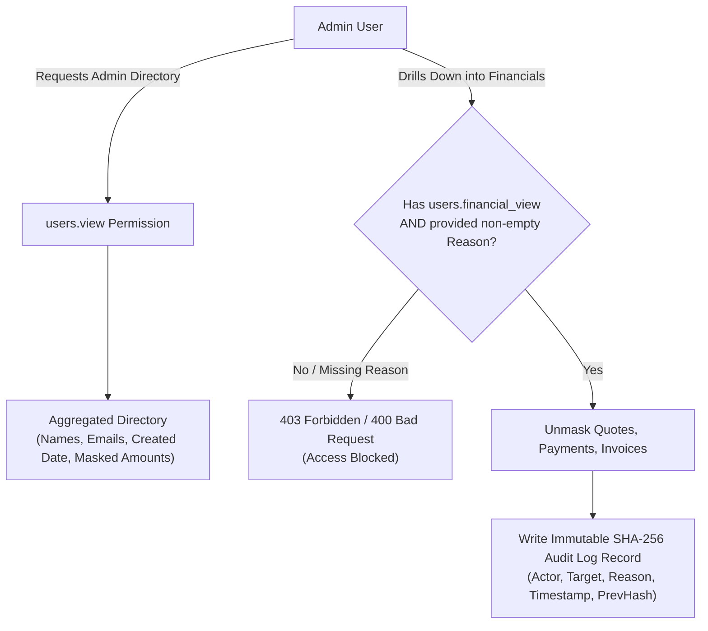

# Wello — Security, Privacy & Compliance Specification

This document details the defense-in-depth security architecture, personal income privacy controls, cryptographic tamper-evident audit ledger, and operational safeguards implemented across the Wello platform.

---

## 1. Input Validation & Schema Hardening

- **Zod Strict Validation**: All API route handlers enforce `.strict()` schema parsing across `body`, `query`, and `params`. Unrecognized payload attributes are strictly rejected to prevent mass-assignment attacks and prototype pollution.
- **Strict Size Bounds**: Text inputs and JSON payloads have enforced maximum length bounds (e.g. `name: max 100`, `email: max 255`, `notes: max 1000`, `json: max 64KB`).
- **Safe Error Handling**: Server stack traces, raw SQL queries, and internal system paths are stripped from client HTTP responses. Generic HTTP status codes and user-friendly error messages are returned.

---

## 2. HTTP Security Headers & Middleware

Implemented in [`backend/middleware/01.security.ts`](backend/middleware/01.security.ts):

| Header | Production Setting | Security Objective |
| :--- | :--- | :--- |
| `Content-Security-Policy` | `default-src 'self'; script-src 'self' 'unsafe-inline'; ...` | Prevents cross-site scripting (XSS) and data injection. |
| `Strict-Transport-Security` | `max-age=31536000; includeSubDomains; preload` | Enforces HTTPS and protects against SSL stripping (HSTS). |
| `X-Content-Type-Options` | `nosniff` | Blocks MIME-sniffing vulnerabilities. |
| `X-Frame-Options` | `DENY` | Prevents clickjacking by blocking iframe embedding. |
| `Referrer-Policy` | `strict-origin-when-cross-origin` | Protects sensitive URL query parameters from leaking to third parties. |
| `Permissions-Policy` | `camera=(), microphone=(), geolocation=(), payment=()` | Restricts browser hardware and payment API access. |
| `X-Request-ID` | Generated UUID v4 / propagated header | Provides end-to-end request tracing across logs and services. |

---

## 3. Session Security & Secret Protection

- **Passwordless OTP Authentication**: Eliminates password database vulnerabilities.
- **HMAC Code Salting**: OTP codes are salted and verified with `AUTH_HMAC_SECRET`.
- **SHA-256 Token Hashing**: Raw session tokens are never stored in the database. The `auth_sessions` table stores `token_hash = sha256(rawToken)`.
- **HTTP-Only Cookies**: Tokens are transported using HTTP-only, `SameSite=Lax`, secure cookies (`wello_session`).
- **Zero Plaintext Secrets**: Admins cannot view raw OTP codes, session tokens, or unmasked credentials via any API endpoint.

---

## 4. Distributed Rate Limiting Engine

Implemented in [`backend/utils/rateLimiter.ts`](backend/utils/rateLimiter.ts) with MySQL/Redis sliding-window stores:

| Endpoint Route / Action | Quota Limit | Window Duration | Throttling Action |
| :--- | :---: | :---: | :--- |
| **Auth: Send OTP** (`/api/auth/send-otp`) | 5 requests | 5 minutes | `429 Too Many Requests` |
| **Auth: Verify OTP** (`/api/auth/verify-otp`) | 10 attempts | 10 minutes | `429 Too Many Requests` (Reset on success) |
| **Event Ingestion** (`/api/events/track`) | 120 events | 1 minute | `429 Too Many Requests` |
| **Analytics & Reports Export** | 10 exports | 10 minutes | `429 Too Many Requests` |
| **General API Handlers** | 120 requests | 1 minute | `429 Too Many Requests` |

Standard RFC rate-limiting headers are injected on all responses:
- `X-RateLimit-Limit`
- `X-RateLimit-Remaining`
- `X-RateLimit-Reset`
- `Retry-After` (when rate exceeded)

---

## 5. Personal Income Privacy & Admin Console Access Controls

Wello holds sensitive personal income data. The admin console implements strict privacy tiers:

### Key Privacy Controls:
1. **Aggregates by Default**: Admin dashboards and directories display user activity counts without exposing personal hourly targets or monetary amounts.
2. **Dual-Permission Gate**: Viewing individual quotes, invoices, payments, or income sources requires `users.financial_view` (granted only to `SUPER_ADMIN`).
3. **Mandatory Justification Reason**: Access requests without a non-empty `reason` parameter are rejected with `400 Bad Request`.
4. **Moderation Isolation**: Content moderators can review job titles, categories, and flags, but financial amounts remain masked.

---

## 6. Cryptographic Tamper-Evident SHA-256 Audit Ledger

Implemented in [`backend/utils/auditStore.ts`](backend/utils/auditStore.ts):

- **Append-Only Schema**: The `audit_logs` table has no `UPDATE` or `DELETE` application paths.
- **Hash Chain Math**: Each record calculates a canonical SHA-256 hash incorporating the previous record's hash:

$$\text{Block Hash} = \text{SHA256}(\text{prev\_hash} \mid \text{admin\_email} \mid \text{permission} \mid \text{action} \mid \text{target} \mid \text{reason} \mid \text{ip} \mid \text{timestamp})$$

- **Genesis Block**: The initial ledger block links to `0000000000000000000000000000000000000000000000000000000000000000`.
- **Chain Verification**: The `/api/admin/audit-logs/verify` endpoint sequentially recalculates all block hashes from genesis to head, immediately flagging corrupted or tampered records.

---

## 7. File & Logo Upload Defense

Implemented in [`backend/api/upload/logo.post.ts`](backend/api/upload/logo.post.ts) and [`backend/utils/storageDriver.ts`](backend/utils/storageDriver.ts):

- **Magic Byte Validation**: Verifies file headers against binary magic numbers (PNG: `89 50 4E 47`, JPEG: `FF D8 FF`, WebP: `52 49 46 46`).
- **SVG Sanitization**: Strips XML entity declarations (`DOCTYPE`), external references, embedded `<script>` tags, and inline event handlers (`onload`, `onerror`).
- **UUID Filenames**: Files are saved with random UUID keys (e.g. `logo_3fa85f64-5717-4562-b3fc-2c963f66afa6.png`), preventing path traversal and overwrite attacks.
- **Max File Size**: Enforces a strict 2MB limit on logo uploads and 10MB on Nginx ingress.

---

## 8. Support Impersonation Safety

- **Read-Only Enforcement**: Impersonation sessions generated for customer support are strictly read-only.
- **Mutation Rejection**: Any `POST`, `PUT`, `PATCH`, or `DELETE` requests made with an impersonation token are blocked with `403 Forbidden`.
- **Time-Boxed Lifespan**: Impersonation tokens automatically expire after 15 minutes.
- **Audit Requirement**: Support impersonation requires a mandatory support ticket justification reason.

---

## 9. Observability & Sentinel Alert Dispatcher

Implemented in [`backend/utils/alertEngine.ts`](backend/utils/alertEngine.ts) and [`backend/utils/logger.ts`](backend/utils/logger.ts):

- **PII Redaction**: Structured JSON logger automatically redacts passwords, tokens, API keys, cookies, and OTP secrets.
- **Sentry Hook**: Captures runtime exceptions with sanitized contextual metadata (active only when `SENTRY_DSN` is configured).
- **Webhook Alert Sentinel**: Dispatches critical system failures (backup failures, brute-force rate limit spikes, audit tampering attempts) to configured Slack / Discord / PagerDuty webhooks.
