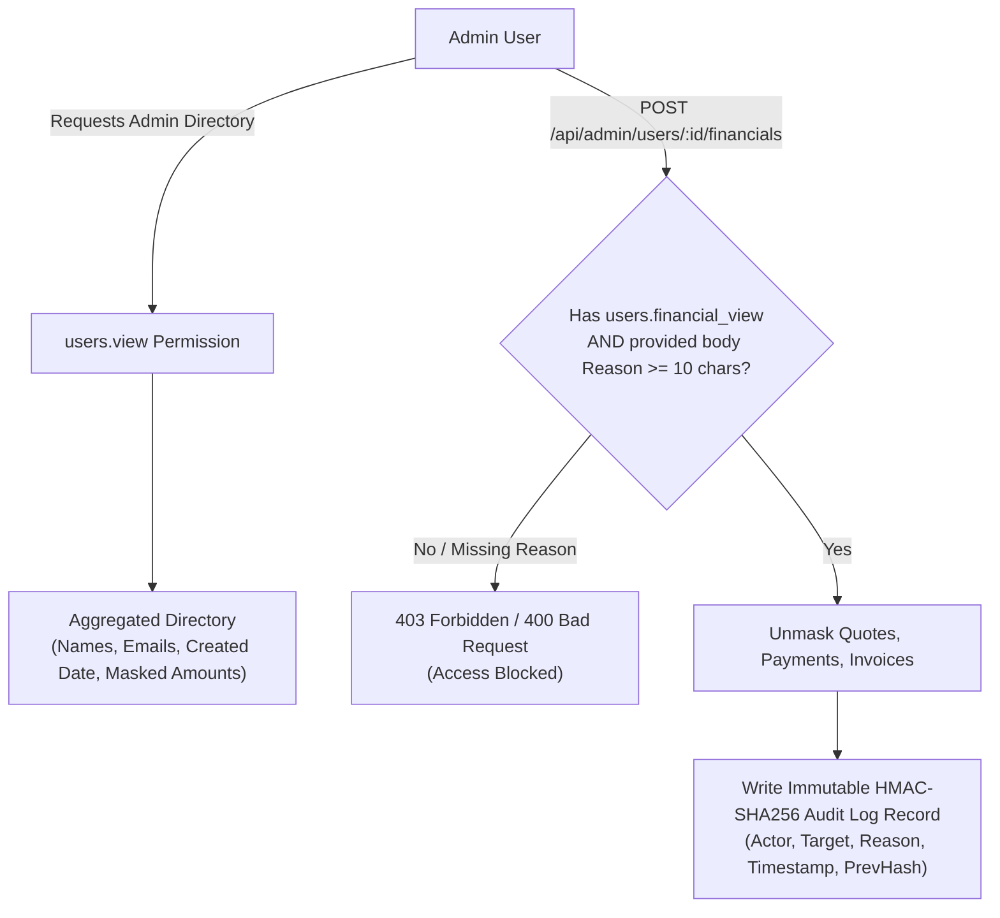

# Wello — Security, Privacy & Compliance Specification

This document details the defense-in-depth security architecture, personal income privacy controls, cryptographic tamper-evident HMAC-SHA256 audit ledger, database-level append-only triggers, read-only impersonation safeguards, and deployment hardening implemented across Wello.

---

## 1. Input Validation & Schema Hardening

- **Zod Strict Validation**: All API route handlers enforce `.strict()` schema parsing across `body`, `query`, and `params`. Unrecognized payload attributes are rejected to prevent mass-assignment attacks and prototype pollution.
- **Strict Size Bounds**: Text inputs and JSON payloads have enforced maximum length bounds (e.g. `name: max 100`, `email: max 255`, `notes: max 1000`, `json: max 64KB`).
- **Safe Error Handling**: Server stack traces, raw SQL queries, and internal system paths are stripped from client HTTP responses. Generic HTTP status codes and user-friendly error messages are returned.

---

## 2. HTTP Security Headers, CSRF & Middleware Defense

Implemented in [`backend/middleware/01.security.ts`](backend/middleware/01.security.ts):

| Header / Guard | Production Setting | Security Objective |
| :--- | :--- | :--- |
| `Content-Security-Policy` | `default-src 'self'; script-src 'self' 'unsafe-inline'; ...` | Prevents cross-site scripting (XSS) and data injection. |
| `Strict-Transport-Security` | `max-age=31536000; includeSubDomains; preload` | Enforces HTTPS and protects against SSL stripping (HSTS). |
| `X-Content-Type-Options` | `nosniff` | Blocks MIME-sniffing vulnerabilities across all routes and `/api/uploads/`. |
| `X-Frame-Options` | `DENY` | Prevents clickjacking by blocking iframe embedding. |
| `Referrer-Policy` | `strict-origin-when-cross-origin` | Protects sensitive URL query parameters from leaking to third parties. |
| `Permissions-Policy` | `camera=(), microphone=(), geolocation=(), payment=()` | Restricts browser hardware and payment API access. |
| `Cross-Origin-Opener-Policy` | `same-origin` | Isolates browsing context from malicious cross-origin popups. |
| `X-Request-ID` | Generated UUID v4 / propagated header | Provides end-to-end request tracing across logs and services. |
| **CSRF Origin Guard** | Validated against `CORS_ORIGIN` allowlist | Blocks state-changing (`POST`/`PUT`/`PATCH`/`DELETE`) cookie-authenticated requests originating from untrusted domains. Bearer-only API requests remain exempt. |

---

## 3. Session Security, Authoritative Store & Secret Protection

- **Authoritative Database Sessions**: The `auth_sessions` table serves as the single source of truth. Revoking a session token immediately rejects subsequent requests with `401 Unauthorized`.
- **Passwordless OTP Authentication**: Eliminates password database vulnerabilities.
- **HMAC Code Salting**: OTP codes are salted and verified with `AUTH_HMAC_SECRET`.
- **SHA-256 Token Hashing**: Raw session tokens are never stored in the database. The `auth_sessions` table stores `token_hash = sha256(rawToken)`.
- **HTTP-Only Cookies**: Tokens are transported using HTTP-only, `SameSite=Lax`, secure cookies (`wello_session`).
- **Zero Plaintext Secrets**: Admins cannot view raw OTP codes, session tokens, or unmasked credentials via any API endpoint.

---

## 4. Distributed Rate Limiting & Abuse Prevention

Implemented in [`backend/utils/rateLimiter.ts`](backend/utils/rateLimiter.ts) with MySQL/Redis sliding-window stores and composite `${identifier}:${clientIp}` keying:

| Endpoint Route / Action | Quota Limit | Window Duration | Throttling Action |
| :--- | :---: | :---: | :--- |
| **Auth: Send OTP** (`/api/auth/send-otp`) | 5 requests | 5 minutes | `429 Too Many Requests` |
| **Auth: Verify OTP** (`/api/auth/verify-otp`) | 10 attempts | 10 minutes | `429 Too Many Requests` (Reset on success) |
| **Category Requests** (`/api/category-requests`) | 5 requests | 1 hour | `429 Too Many Requests` |
| **Event Ingestion** (`/api/events`) | 120 requests | 1 minute | `429 Too Many Requests` |
| **Analytics & Reports Export** | 10 exports | 10 minutes | `429 Too Many Requests` |
| **Public Invoice/Quote Views** | 60 views | 1 minute | `429 Too Many Requests` |
| **General API Handlers** | 120 requests | 1 minute | `429 Too Many Requests` |

Standard RFC rate-limiting headers are injected on all responses:
- `X-RateLimit-Limit`
- `X-RateLimit-Remaining`
- `X-RateLimit-Reset`
- `Retry-After` (when rate exceeded)

---

## 5. Personal Income Privacy & Admin Console Access Controls

Wello holds sensitive personal income data. The admin console implements strict privacy tiers:

```mermaid
graph TD
    Admin["Admin User"] -->|Requests Admin Directory| UsersView["users.view Permission"]
    UsersView --> DirectoryView["Aggregated Directory<br/>(Names, Emails, Created Date, Masked Amounts)"]
    
    Admin -->|POST /api/admin/users/:id/financials| FinViewCheck{"Has users.financial_view<br/>AND provided body Reason >= 10 chars?"}
    FinViewCheck -->|No / Missing Reason| Block403["403 Forbidden / 400 Bad Request<br/>(Access Blocked)"]
    FinViewCheck -->|Yes| FinViewAllowed["Unmask Quotes, Payments, Invoices"]
    FinViewAllowed --> WriteAudit["Write Immutable HMAC-SHA256 Audit Log Record<br/>(Actor, Target, Reason, Timestamp, PrevHash)"]
```

### Key Privacy Controls:
1. **Aggregates by Default**: Admin dashboards and directories display user activity counts without exposing personal hourly targets or monetary amounts.
2. **Dual-Permission Gate**: Viewing individual quotes, invoices, payments, or income sources requires `users.financial_view` (granted only to `SUPER_ADMIN`).
3. **POST-Only Body Reason**: Financial records are accessible solely via `POST /api/admin/users/:id/financials` with a mandatory `{ reason: string }` body parameter ($\ge 10$ characters). Query string reasons are rejected and stripped from logs.
4. **Moderation Isolation**: Content moderators can review job titles, categories, and flags, but financial amounts remain masked.

---

## 6. Cryptographic HMAC-SHA256 Tamper-Evident Audit Ledger

Implemented in [`backend/utils/auditStore.ts`](backend/utils/auditStore.ts) and Migration 18:

- **Keyed HMAC-SHA256 Chain**: Each record calculates a canonical HMAC-SHA256 hash using `AUDIT_HMAC_SECRET`, incorporating the previous record's hash:

$$\text{Block Hash} = \text{HMAC-SHA256}_{K}(\text{prev\_hash} \mid \text{admin\_email} \mid \text{permission} \mid \text{action} \mid \text{target} \mid \text{reason} \mid \text{ip} \mid \text{timestamp})$$

- **MySQL Database Append-Only Triggers**: Database triggers `before_audit_logs_update` and `before_audit_logs_delete` raise SQLSTATE 45000 exceptions on any `UPDATE` or `DELETE` attempt, making the ledger structurally immutable at the database engine level.
- **Chain Verification**: The `/api/admin/audit-logs/verify` endpoint sequentially recalculates all block hashes from genesis to head, pinpointing `corruptedAtId` and `brokenIndex` if tampering occurs.
- **Off-Database Head Anchoring & Alerting**: Daily scheduled verification anchors the head hash to `./backups/audit_anchors.log` and triggers critical security alerts via `alertEngine` if tampering is detected.

---

## 7. Support Impersonation Safety & Financial Masking

Implemented in [`backend/utils/authGuard.ts`](backend/utils/authGuard.ts), [`backend/utils/authService.ts`](backend/utils/authService.ts), and [`backend/api/admin/users/impersonate.post.ts`](backend/api/admin/users/impersonate.post.ts):

- **Strict Empty Allowlist for Non-GET**: Every state-changing route (`POST`, `PUT`, `PATCH`, `DELETE`) is denied with `403 Forbidden` during impersonation (only `/api/auth/impersonate/exit` and single-session logout are exempt).
- **Export & PDF Download Blocking**: Bulk exports (`/api/export/*`) and PDF downloads (`/api/invoices/:id/pdf`) return `403 Forbidden` during impersonation.
- **Automatic Financial Masking**: All financial endpoints (`/api/metrics/summary`, `/api/invoices`, `/api/invoices/:id`, `/api/income-sources`, `/api/overhead-expenses`, `/api/me`) return masked/zeroed amounts unless the admin holds `users.financial_view` and supplied an explicit $\ge 10$-character reason.
- **Dedicated Table & Audit**: Impersonation sessions are recorded in `impersonation_sessions` with time-boxed 15-minute expiration, and every executed request writes an audit log entry.

---

## 8. Public Token Portals & Client Payment Claims

Implemented in [`backend/api/invoices/public/`](backend/api/invoices/public/) and [`backend/api/quotes/public/`](backend/api/quotes/public/):

- **192-bit High-Entropy Tokens**: Public URLs utilize 192-bit base64url random tokens. The database stores SHA-256 hashes in `public_token_hash`.
- **Anti-Enumeration 404s**: Revoked, expired, or non-existent tokens return generic 404 responses without leaking resource existence.
- **Anti-Indexing Privacy Headers**: Public portals inject `Referrer-Policy: no-referrer`, `X-Robots-Tag: noindex, nofollow`, and `Cache-Control: no-store`.
- **Payment Claims Workflow**: Clients submit payment claims via `POST /api/invoices/public/:token/action` which records a `PENDING` claim in `payment_claims` and notifies the invoice owner. Invoices are never self-marked as `PAID` by the client; the owner must confirm the claim via `POST /api/invoices/:id/confirm-claim`.

---

## 9. Public Surfaces & Diagnostic Security

- **Minimal Public `/api/health`**: Public health check returns only `{ status: "healthy", timestamp }`.
- **Protected Diagnostic `/api/health/details`**: Memory usage, database connection status, and runtime metrics require authenticated admin access.
- **Path Traversal Protection**: Upload handlers reject directory traversal sequences (`..`, `/`, `\`).

---

## 10. Deployment & Infrastructure Hardening

- **Internal Container Networking**: MySQL and Redis container ports are bound strictly to `127.0.0.1` in `docker-compose.yml`, preventing direct internet exposure.
- **Dev Profiles**: Mailpit local SMTP sandbox is assigned to `profiles: ["dev"]`, ensuring it does not run in production.
- **AES-256-GCM Backup Encryption**: Database backups can be encrypted with AES-256-GCM via `BACKUP_ENCRYPTION_KEY` using `scripts/db_backup_restore.mjs`.
